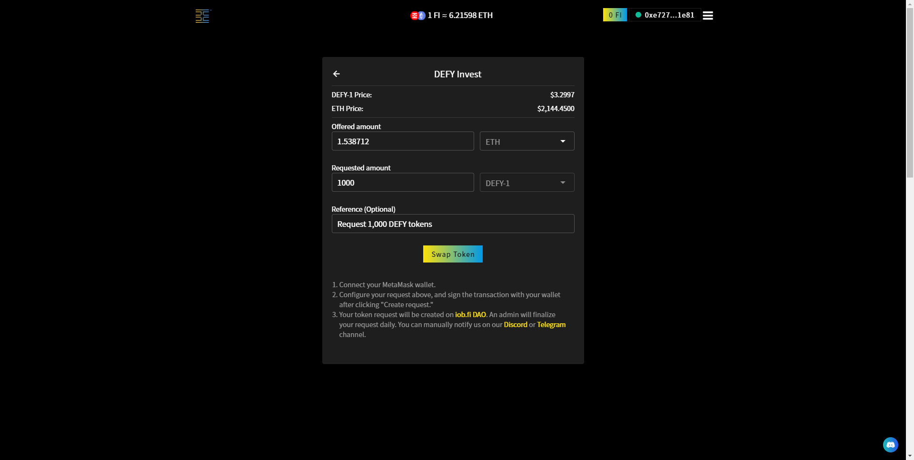

# How to invest in Defy by buying DEFY token

## **Open** [**iob.fi**](https://iob.fi) **homepage**

Step 1: Find the **banner** on the [iob.fi](https://iob.fi) homepage and click. (Click [here ](https://iob.fi/pool/0x7af3b2b4093bd52309fe374c5fd05e215762c20c/buy)to skip to step 3.)

.png>)

Step 2: Click the **"DEFY Invest"** button.

.png>)

Step 3: In the window **"DEFY Invest"**, click **“Connect Wallet”**. (If you already connected the wallet, skip to Step 6.)

.png>)

Step 4： In **“Connect Wallet”** window，select a wallet (currently **“MetaMask”** and more selection under development)

.png>)

Step 5：After successful connect to wallet, you will find your **wallet address** and **balance** in the upper right corner.&#x20;

.png>)

Step 6：Then you can back to **"DEFY Invest"** window and input amount of **ETH (or USDT、DAI)** or amount of **DEFY-1**. You can also leave a note in **"Reference"** field. After that, click **"Swap Token"** button.

`Note: The number of tokens received may be slightly different due to changes in market prices.`

Step 7：**"MetaMask Notification"** will request your confirmation, click **"Confirm"** button to confirm this transaction.

Step 8:  Then your transaction has been signed and sent to the network for processing.  Click **"See on Etherscan"** to view details on the Ethereum network.  After this transaction successfully recorded on ethereum network, you can find it in [Defy DAO](https://client.aragon.org/#/defy/0xf783b9e19597d212e3fa61cb71d62e7c5cba2422/) and just waiting for pool managers' approval.&#x20;

.png>)

## [Buy DEFY-1 today!](https://iob.fi/pool/0x7af3b2b4093bd52309fe374c5fd05e215762c20c/buy)

