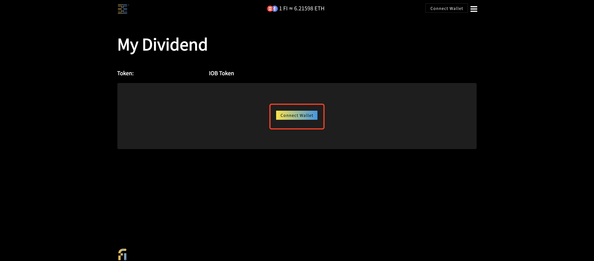
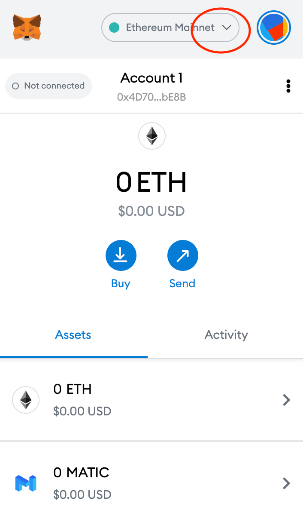
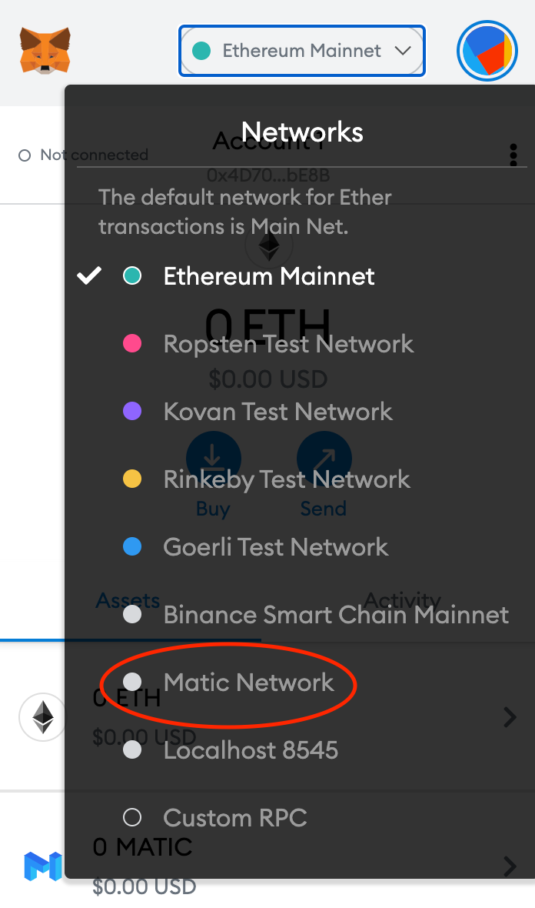
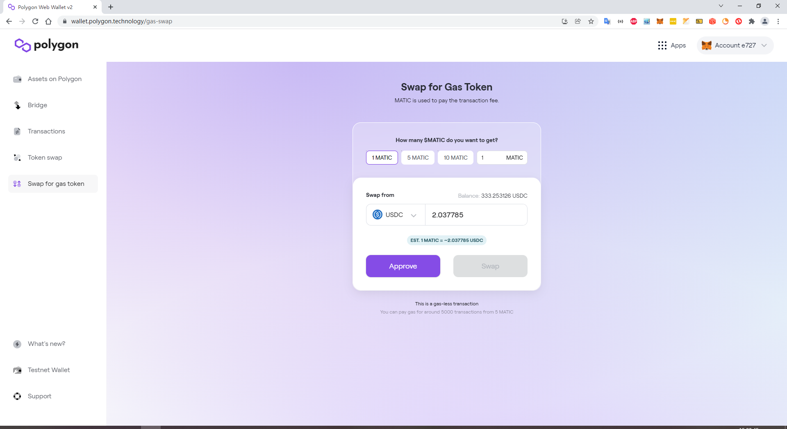

# 请求并使用 2021 IOB 股息

## 1. 请求

### 第1步:&#x20;

在 [iob.fi](https://iob.fi/) 首页, 点击 "**菜单**" 按钮并在侧边栏选择 "**管理的基金池**" 标签。

.png>)

### 第2步:&#x20;

点击 "**2021 IOB 股息**" 按钮，您也可以单击下面显示的广告横幅。 (点击 [https://iob.fi/dividend/0x6130ff302f24267380753e52ece48b852be3dd38](https://iob.fi/dividend/0x6130ff302f24267380753e52ece48b852be3dd38) 跳转到第3步。)

或者

.png>)

### 第3步:&#x20;

点击 **"连接钱包"** 按钮.

在 **“连接钱包”** 窗口，选择一个钱包 (当前仅支持 **“MetaMask”** ，更多选择正在开发中。)

### 第4步: &#x20;

确认我的钱包地址 (0x5b4......5b9e) 被用于请求 IOB 股息。 点击 **"请求"** 按钮。

### 第5步: &#x20;

**"已请求!"**&#x20;

.jpg>)

注意：一旦您申请了股息，您的合格股息将重置为“0”。

## **2.** 在 Polygon 网络上获取您的股息

### 第1步:&#x20;

在 MetaMask 上添加 [**Polygon 网络**](https://docs.polygon.technology/docs/develop/metamask/config-polygon-on-metamask/)

### 第2步:&#x20;

在 [**Polygon 钱包**](https://wallet.polygon.technology/) 查看并确认您的 **USDC余额**

.png>)

2.1 如果您决定将 **USDC** 保留在 **Polygon** 网络的钱包中，请什么也不要做。

2.2 如果要从钱包中转账，首先您需要使用刚刚收到的 **USDC** 通过无气体交换功能去兑换少量的 **MATIC** 代币（只需 5-10 美分）。

2.2.1 如果您想要将 **USDC** 转账到 [**交易所**](https://docs.polygon.technology/docs/faq/wallet-bridge-faq/#what-are-the-list-of-supported-exchanges-on-polygon), 当前您只能通过 **Polygon** 网络发送到以下3个交易所**: crypto.com**, **欧易** 或者 **币安**。

## <mark style="color:red;">如果您尝试将它们转移到任何其他交易所，您将丢失您的 USDC！千万不要做！</mark>

**如果不确定, 首先请到我们的** [**电报**](https://t.me/+Swx7dK5JMJfBcXBm) **群里进行询问!**

### 第3步:

您还可以通过他们的 Polygon 网络将您的钱包连接到 **Uniswap**，就可以将 USDC 兑换成任何您想要的代币。

<mark style="color:red;">请记住，USDC 就在您的 Polygon 网络上的钱包中。 您不需要“把它拿出来”。 只要您拥有钱包的私钥，它就已经存在。</mark>

## 结论

## <mark style="color:red;">除非您必须将收到的股息兑换成美元、欧元或任何其他法定货币，否则真的没有理由“把它拿出来”。 资金在 Polygon 网络上的钱包中（几乎与以太坊网络上相同），您几乎可以免费将其兑换成其他代币。</mark>
