# Popular Vote Token Request and Voting

## Setting up MetaMask on PC

MetaMask is a Web3 wallet. Rinkeby uses test ETH, not the regular ETH.&#x20;

### Installing MetaMask for your browser

Chrome: [https://chrome.google.com/webstore/detail/metamask/nkbihfbeogaeaoehlefnkodbefgpgknn](https://chrome.google.com/webstore/detail/metamask/nkbihfbeogaeaoehlefnkodbefgpgknn) Firefox: [https://addons.mozilla.org/en-US/firefox/addon/ether-metamask/](https://addons.mozilla.org/en-US/firefox/addon/ether-metamask/)

#### Creating a wallet and store your seed phrase in a safe place

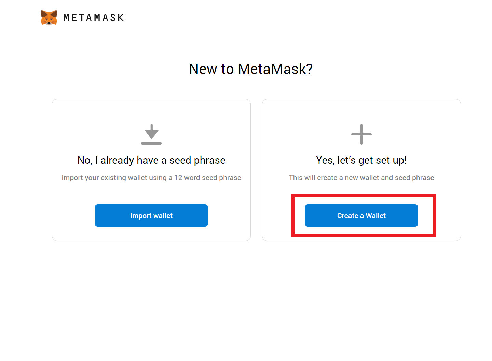

#### Changing your network to Rinkeby

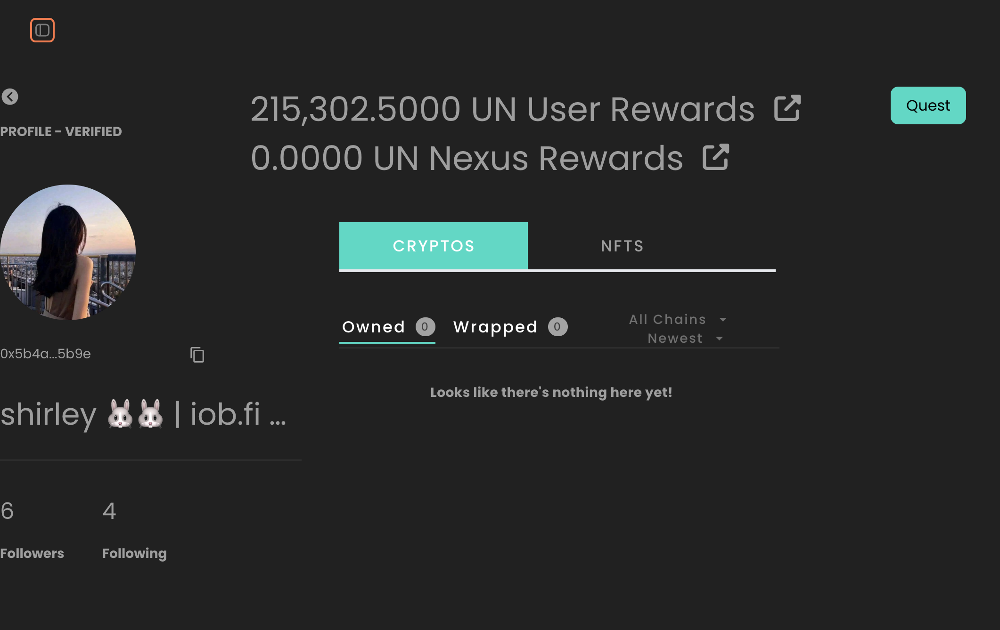

## Requesting some test ETH for your new MetaMask wallet

Go to [https://faucet.rinkeby.io/](https://faucet.rinkeby.io/)

Click the tweet button at the bottom of the page.

.png>)

Sign in or create a twitter account.

Replace the 0x0 address with your own from MetaMask.

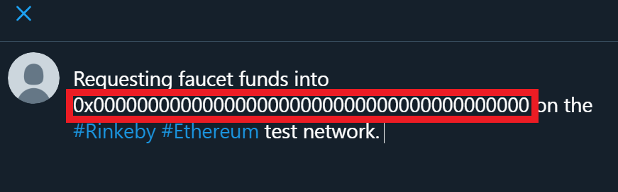

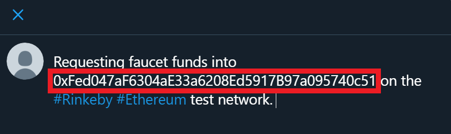

Tweet it and copy the link to the tweet.

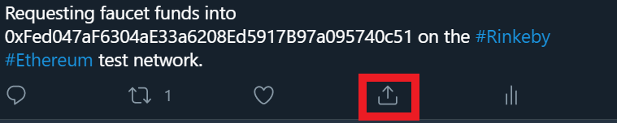

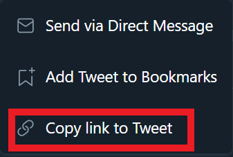

Go back to the Rinkeby faucet and paste your tweet link in.

Select 18.75 Ethers / 3 days.

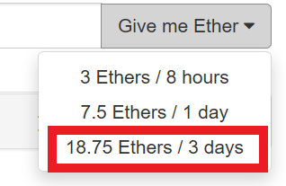

Congrats! You can now use MetaMask on Rinkeby.

## Requesting FI-POPULAR-VOTE Tokens from Token Request

1. Go to [iob.fi DAO Popular Vote Token Request](https://rinkeby.client.aragon.org/#/fipopularvote/0x9e1110b76b469d020184da374ddb334c2fc5308f/) page.&#x20;
2. Connect your MetaMask wallet.

.png>)

Make a new request for 368 FI-Popular-Vote Tokens.

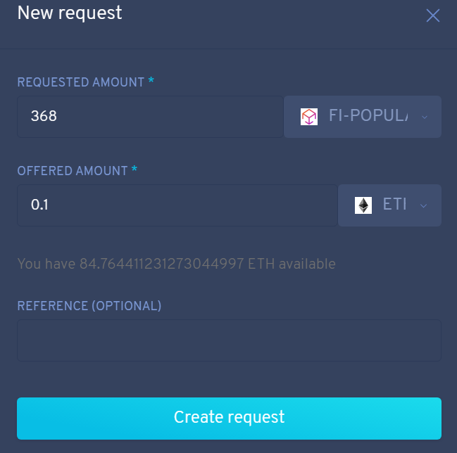

Create the transaction

Confirm the transaction

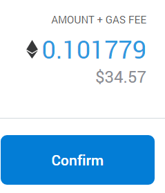

Go to My Requests

Submit your request

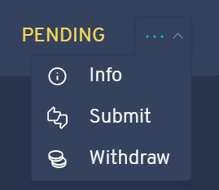

Create the transaction

Confirm the transaction

You now have 368 FI-Popular-Vote Tokens!

## Adding a custom token to your MetaMask Wallet

Click the Add Token button in MetaMask.

Click Custom Token

Enter the FI Popular Vote token address and click Edit

Change the name to FI-Popular and click Next

Finally, click Add Tokens

## Voting on the Rinkeby DAO

Go to [https://rinkeby.client.aragon.org/#/fipopularvote/](https://rinkeby.client.aragon.org/#/fipopularvote/)

Connect your MetaMask

Go to the Voting app.

Whenever there is a vote, you can vote on it. Once you have gotten FI-Popular-Vote Tokens from an airdrop.

Open a vote.

Choose Yes or No accordingly.

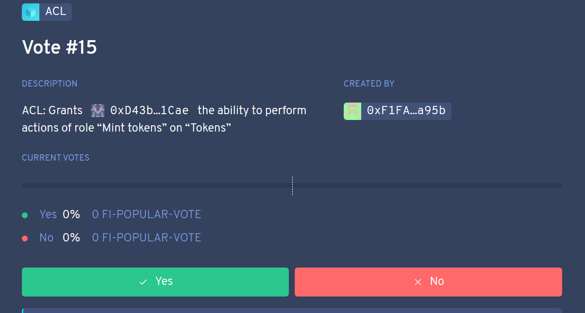

Create the transaction

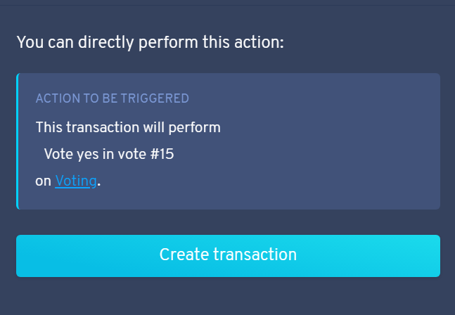

Confirm the transaction

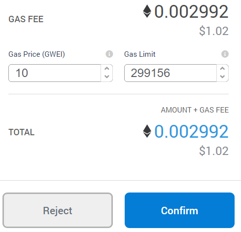

#### Congrats!

You have successfully voted on the DAO!
