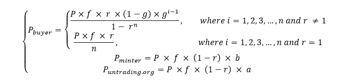
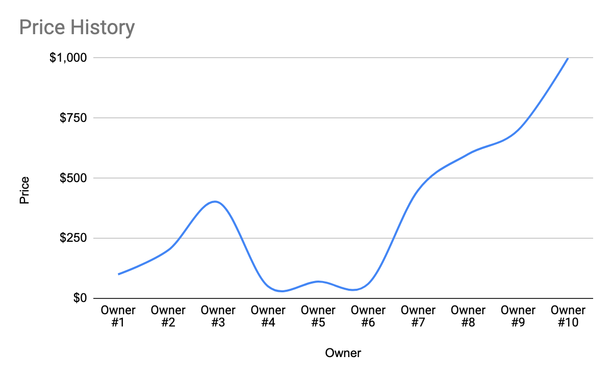

# 📃 Whitepaper

<mark style="color:green;">Past. Future. Rewarded.</mark>


by Yale ReiSoleil, @dRadiant, D Wang, PhD

March, 2024

_v. 2.1.1 beta_


<figure><figcaption></figcaption></figure>

## Disclaimer <a href="#h.17v05jnu7qff" id="h.17v05jnu7qff"></a>


This paper is for general information purposes only. It does not constitute investment advice or a recommendation or solicitation to buy or sell any investment and should not be used in the evaluation of the merits of making any investment decision. It should not be relied upon for accounting, legal or tax advice, or investment recommendations. This paper reflects the current opinions of the authors. The opinions reflected herein are subject to change without being updated.


## <mark style="color:green;">Abstract</mark>

Untrading Technologies Pte Ltd (Untrading) is a platform that offers decentralized investment strategies for asset management. Untrading is built on open-source DeFi protocols, which enable anyone to access institutional-grade investment strategies in a transparent, secure, and fair way.

### <mark style="color:green;">Key Features</mark>

* **Hedge Fund Strategies:** Untrading provides hedge fund black-box trading strategies as non-custodial, permissionless, and self-directed open-source products. These products are available to both retail and institutional investors, who can choose from a variety of strategies according to their preferences and risk profiles.
* **Zero Commissions:** Untrading charges no commissions for using its platform, aligning the interests and fostering the collaboration among token holders.
* **Multi-Signature Contracts:** User assets are protected through secure multi-signature contracts, ensuring the utmost security of their funds.
* **Upgradable Smart Contracts:** Untrading prioritizes continuous improvement by utilizing upgradable smart contracts, ensuring the platform’s security and adaptability.

### <mark style="color:green;">Strategy 1 - Provenance Value Amplification (PVA)</mark>

Untrading introduces an innovative feature called Provenance Value Amplification (PVA). This standardized profit-sharing model applies to the entire ownership history of an NFT or a wrapped ERC-20 token on the Ethereum and Polygon networks. PVA enables you to buy and sell your digital assets while continuing to benefit from potential future price appreciation, even after the sale. Through this model, Untrading creates an ecosystem where value is amplified and shared equitably among all historical and future owners, fostering a collaborative approach to wealth creation.

How it works:

1. **Sell and Get a Share of Future Profits:** When you sell a cryptocurrency or NFT on Untrading, you can still earn a percentage of a certain number of future price increases of that specific asset.&#x20;
2. **Automatic On-Chain Rewards:** These rewards are automatically and securely distributed through the blockchain (on-chain) every time the same asset sells for a higher price on the platform.

Essentially, PVA lets you unlock the immediate value of your assets while retaining a stake in their potential future growth. This groundbreaking concept challenges traditional trading, where selling an asset typically means losing all future upside potential.

#### PVA Revolutionizes the Industry

* **Enhanced Transparency:** PVA seamlessly integrates buyer and seller information into time and sales (T\&S) data, enhancing the transparency throughout the asset transaction process.
* **Cutting-Edge Divisible NFT Framework:** PVA introduces a novel framework that merges the strengths of ERC-20 and ERC-721 standards. This enables efficient fractional token transfers and streamlines DAO treasury management.

#### Beyond Traditional Finance

By challenging traditional norms, Untrading explores transformative possibilities for the industry.

### <mark style="color:green;">Strategy 2 - Statistical Arbitrage Market Making Yield (SAMMY) (Coming Q1 2025)</mark>&#x20;

Untrading is poised to introduce a powerful new feature: Statistical Arbitrage Market Making Yield (SAMMY). This innovative approach, coming in Q1 2025, unlocks benefits for both users and crypto platforms themselves.&#x20;

This feature will offer hedge fund strategies that use statistical arbitrage techniques. Statistical arbitrage is a group of trading strategies that exploit price inefficiencies across different financial instruments. This will let Untrading users join high-frequency trading opportunities without risk. High-frequency trading is a type of trading that uses powerful computers and algorithms to execute a large number of orders in a short time.&#x20;

Untrading will use this strategy for its token on various exchanges in Q3, 2024. We will also offer market making services to cryptocurrency projects and exchanges. Market making is a process of providing liquidity and setting prices for buyers and sellers. This will put Untrading in a good position to offer more B2B services to other projects and platforms. We will be able to charge higher fixed monthly fees as a value-added market maker that brings capital and liquidity to the projects and exchanges. Liquidity is the ease of buying and selling an asset without affecting its price.&#x20;

As part of the service contract with projects, Untrading can also get performance-based long-term token options. Token options are contracts that give the right, but not the obligation, to buy or sell a token at a specified price and time. These options will ensure more profits for Untrading, as we can benefit from the future price increases of the tokens we provide market making for.

\_\_\_\_\_\_\_\_\_\_\_\_\_\_\_\_\_\_\_\_\_\_\_\_\_\_

The paper will discuss the foundations of the Untrading protocol. A number of new financial innovations have recently emerged, but not all of them offer the same features as untrading.org.

We would like to thank the following reviewers, whose contributions and feedback made this document possible:

Simon Telfer

Francois Baechtold

\_\_\_\_\_\_\_\_\_\_\_\_\_\_\_\_\_\_\_\_\_\_\_\_\_\_\_


## <mark style="color:green;">01        Introduction</mark> <a href="#h.5php9w692ai5" id="h.5php9w692ai5"></a>

### <mark style="color:green;">1.1           The Challenges of Retail Trading</mark>

The traditional asset management landscape presents numerous hurdles for retail investors:

* **High Loss Rates:** Shockingly, over 90% of active retail traders lose money. Some exchanges prioritize their own profits over user success, potentially benefiting from higher fees, forced liquidations, or even taking the opposite side of user trades.&#x20;
* **Hidden Costs:** Retail investors often face a barrage of fees, including commissions, interests, funding rates, withdrawal fees, slippages, and hidden charges, which significantly eat into their potential returns.&#x20;
* **Limited Access:** Historically, access to sophisticated investment strategies has been reserved for institutional investors due to high minimum investment requirements and complex entry points, leaving retail investors at a disadvantage.

The cryptocurrency market has attracted a wave of new investors, many unfamiliar with traditional financial markets. While attracted by the potential for high returns and the dynamic nature of the crypto landscape, many end up losing money due to various factors that will be explored in the following sections.

#### <mark style="color:green;">1.1.1</mark>          Misleading Information

* **Exchanges and influencers:** Some crypto exchanges and influencers have been accused of promoting risky trading practices and exaggerating potential profits. This misleading information can create unrealistic expectations and encourage impulsive decision-making among inexperienced investors.&#x20;
* **Social media hype:** The fast-paced and dynamic nature of the crypto market, combined with the echo chambers of social media, can lead to the spread of exaggerated claims and FOMO (fear of missing out) mentality. This can influence investors to make hasty decisions based on hype rather than thorough research and sound investment strategies.

#### <mark style="color:green;">1.1.2</mark>          Lack of Experience and Knowledge

* **New to investing:** Many new investors entering the crypto market lack the experience and knowledge necessary to navigate this complex and volatile environment. They may not understand fundamental factors influencing crypto prices, technical analysis tools, or essential risk management practices.&#x20;
* **Ignoring traditional investment principles:** Some new investors, especially those with limited financial knowledge, may neglect fundamental investment principles like diversification, risk management, and long-term planning. They might be tempted to chase quick gains, overlooking the inherent risks associated with cryptocurrencies.

#### <mark style="color:green;">1.1.3</mark>          Limited Access to Professional Strategies

* **High minimum investments:** Traditional institutions offering sophisticated investment strategies typically require high minimum investments, making them inaccessible to most retail investors.&#x20;
* **Complexity and opaqueness:** Even if accessible, these strategies might be complex and difficult for beginner investors to understand and manage effectively.

### <mark style="color:green;">1.2           These Factors Contribute to A Vicious Cycle</mark>

* **High losses:** Over 90% of active retail traders reportedly lose money within a short period, leading to frustration and potentially significant financial losses.&#x20;
* **Discouragement and distrust:** These negative experiences can discourage or even prevent these individuals from seeking professional advice or exploring other avenues for wealth creation.&#x20;
* **Perpetuation of the cycle:** This pattern of misinformation, lack of knowledge, and limited access to professional strategies creates a cycle that continues to trap new investors in the same pitfalls.

### <mark style="color:green;">1.3            To Break This Cycle</mark>

* **Promoting responsible education:** Regulatory bodies and financial institutions can play a crucial role in educating new investors about the risks and complexities of the crypto market.&#x20;
* **Encouraging responsible marketing:** Exchanges and influencers should be held accountable for disseminating accurate information and avoiding misleading practices.&#x20;
* **Developing accessible, transparent strategies:** Providing retail investors with access to affordable, transparent, and well-structured investment options could empower them to make informed decisions.

By addressing these challenges, the crypto market can become a more sustainable and inclusive environment, promoting responsible investment and protecting new participants from unnecessary risks.

### <mark style="color:green;">1.4          The Solution: Decentralized Strategies as a Platform (dSaaP)</mark>

Untrading ushers in a transformative concept: Decentralized Strategies as a Platform (dSaaP). This groundbreaking approach disrupts the traditional asset management landscape by leveraging the power of decentralized finance (DeFi) technology.

#### <mark style="color:green;">1.4.1</mark>           dSaaP in Action

* **Decentralized and Transparent:** Unlike traditional models riddled with opaqueness and centralized control, dSaaP empowers individuals. It offers a decentralized, transparent, and secure alternative, fostering trust and user control.&#x20;
* **Untrading as a Pioneer:** Untrading stands at the forefront of this revolution, granting users access to institutional-grade investment strategies built on open-source DeFi protocols. This empowers individuals with the tools and knowledge traditionally reserved for the privileged few, enabling them to pursue their financial goals with increased autonomy.&#x20;
* **Shared Economics Ecosystem:** Untrading fosters a shared economics ecosystem, benefiting all stakeholders. By eliminating unnecessary intermediaries and leveraging the efficiencies of blockchain technology, dSaaP reduces costs and fosters collaboration, creating a win-win scenario for users and the platform.

#### <mark style="color:green;">1.4.2</mark>          Understanding the Power of DeFi

dSaaP thrives by leveraging the power of decentralized finance (DeFi). DeFi aims to establish an open, permissionless, and trustless financial system built on blockchain technology. This innovative approach enables users to participate in various financial activities, such as lending, borrowing, trading, investing, and earning interest, without relying on centralized authorities or intermediaries.

#### <mark style="color:green;">1.4.3</mark>           Untrading as a dSaaP Platform

Untrading serves as a dSaaP platform, providing users access to diverse investment strategies implemented on DeFi protocols. These strategies, designed by experienced and qualified professionals, offer transparency, security, and fairness. This is achieved through the use of smart contracts, self-executing contracts on the blockchain, and third-party audits that ensure the integrity and security of the strategies.&#x20;

In essence, dSaaP, as embodied by Untrading, empowers individuals to take control of their financial future by providing access to sophisticated investment strategies in a transparent, secure, and collaborative environment.

#### <mark style="color:green;">1.4.4</mark>            Here's What Makes dSaap so Transformative

By using dSaaP, users can benefit from the following advantages:

* **Democratization of investment strategies:** dSaap allows anyone, regardless of their investment size or experience level, to access and benefit from previously inaccessible institutional-grade investment strategies.&#x20;
* **Transparency and composability:** dSaap relies on open-source DeFi protocols, ensuring complete transparency in the investment process. This allows users to understand and analyze the underlying strategy, fostering trust and confidence. Additionally, dSaap operates in a modular fashion, enabling the building and integration of various DeFi components for diverse investment goals.&#x20;
* **Reduced fees:** By eliminating intermediaries and leveraging the efficiencies of blockchain technology, dSaap offers significantly lower fees compared to traditional asset management options. This empowers individuals to retain more of their investment returns.&#x20;
* **Increased security and control:** dSaap leverages the inherent security features of blockchain technology, such as immutability and censorship resistance, to safeguard user assets. Additionally, users maintain full control over their investments, eliminating reliance on centralized entities.

#### <mark style="color:green;">1.4.5</mark>           Beyond just lowering fees and increasing accessibility, dSaap brings several key advantages

* **Innovation and customization:** dSaap serves as a platform for continuous innovation and development of new investment strategies. Users are empowered to customize and personalize their investment experience by choosing from a diverse range of strategies built on the platform.&#x20;
* **Community-driven governance:** dSaap can facilitate community-driven governance models, allowing users to participate in decision-making and contribute to the platform's evolution.

In conclusion, dSaap has the potential to fundamentally reshape the landscape of asset management, empowering individuals with greater control, transparency, and access to sophisticated investment opportunities.\
\_\_\_\_\_\_\_\_\_\_\_\_\_\_\_\_\_\_\_\_\_\_\_

_This paper is organized into five sections and discusses three key features: 1) Provenance Value Amplification (PVA), which enables users to trade their cryptocurrencies and NFTs without losing the future value of their assets, 2) Statistical Arbitrage Market Making Yield (SAMMY), a feature that will offer market-neutral hedge fund strategies that leverage statistical arbitrage techniques, and 3) UN tokenomics. The paper also discusses the challenges of the traditional financial trading system and how Untrading aims to revolutionize the industry by offering its users a fair, transparent, and accessible platform._

## <mark style="color:green;">02           Strategy 1 - Provenance Value Amplification (PVA) Framework</mark>

Provenance Value Amplification (PVA) Framework Strategy is a revolutionary asset transaction protocol on the Ethereum and Polygon networks, employs ERC-5173, the innovative Non-fungible Future Rewards (nFR) framework, as the foundation of its Provenance Value Amplification (PVA) model. This groundbreaking approach empowers token holders to actively participate in future price increases, even after selling their tokens, with resilient rewards distributed through an on-chain payment mechanism.

By eliminating commissions, Untrading fosters a collaborative wealth creation ecosystem, aligning the interests of token holders. User asset protection is ensured through the implementation of multi-signature contracts.

The platform revolutionizes the industry by seamlessly integrating buyer and seller information into time and sales (T\&S) data, enhancing transparency, value, and security throughout the asset transaction process.

Additionally, Untrading introduces a cutting-edge divisible NFT framework, merging the strengths of ERC-20 and ERC-721 standards. This framework enables efficient fractional token transfers and offers optimization opportunities for managing DAO treasuries.&#x20;

With its commitment to continuous improvement, Untrading.org ensures the platform's security and adaptability through upgradable smart contract deployment. By challenging the long-standing norms of traditional asset exchanges, Untrading explores transformative possibilities for the industry.

### <mark style="color:green;">2.1        Share Only After Making a Profit</mark> <a href="#h.kplu6gt7s2fs" id="h.kplu6gt7s2fs"></a>

At Untrading, we support trading platforms that don’t charge users for losses. Instead, we use a hedge fund-inspired incentive fee model where users only pay if they profit.&#x20;

With the PVA Framework, there are no commissions, deposit fees, transfer fees, or withdrawal fees. Instead, we share a small part of a user’s profit with the Minters as o-token holders, making revenue.&#x20;

This approach creates a more equitable trading environment and discourages unauthorized deals that break the rules of artists, creators, and marketplaces. Join the Flow today for a new way of trading where you pay only after making a profit.

### <mark style="color:green;">2.2        PVA Use Cases</mark> <a href="#h.o4p39l4e3q7k" id="h.o4p39l4e3q7k"></a>

#### **Original NFT**

Users can mint and list artworks on untrading.org to receive two types of tokens simultaneously, the unNFT tokens for trading and the unlisted o-tokens for receiving royalty payments. Minters receive additional Future Rewards distributions if they sell their unNFTs as first generation owners.

#### **Third-party NFT wrapping**

The untrading.org platform allows users to wrap existing NFTs they have purchased from any other marketplace and upgrade them into unNFTs. Minters who wrap the existing NFTs are now both the originators and owners on the untrading.org platform and will receive both the new royalty payments and the FR distributions.

#### **Applications**

The untrading.org script language will allow the development of applications to handle a wide range of trading capabilities, including trading on centralized and decentralized marketplaces, derivative issuance, and trading handled by regulated transfer agents, among others. This allows any unNFT to be traded on third-party marketplaces and exchanges.

#### **Content Curation**

Users of untrading.org can gather around collections, styles, and art movements of shared interests.

#### **Social**

Groups that currently gather in online forums, chat groups, online trading analytical websites, or even other centralized marketplaces could port their communities into untrading.org.

#### **Financial derivatives**

Major cryptocurrencies such as Bitcoin, Ethereum, and SOL can be upgraded into un-token standard derivatives on untrading.org. In addition, other traditional financial assets, such as stocks, real estate, and any other quoted securities, may also be converted into derivatives by utilizing third-party custodians and transfer agents. &#x20;

**DAO Native Tokens and Treasury Management**

As there are no technical specifications governing what can be wrapped for listing and trading on untrading.org, there may be additional use cases involving upgrading the startup funding methods. The founders of startup projects may use untrading.org to raise funds. The founders, team members, and advisors receive o-tokens, but only the paying investors receive un-tokens. The team is considered the Minter, and will receive royalties perpetually from the success of the project whenever an un-token holder, the investor, makes a profit.

The investors' confidence in the new funding increases since the founders' financial incentives are truly linked to the investor's profitability, in addition, rug-pulling is prevented.

### <mark style="color:green;">2.3</mark>       Definitions <a href="#h.o4p39l4e3q7k" id="h.o4p39l4e3q7k"></a>

**Non-fungible Future Reward Protocol (nFR):** Also known as Ethereum Improvement Proposal (EIP-5173), nFR is an ERC721 token extension that  enables owners of EIP-721 tokens (NFTs) to participate in future price increases after they sell their tokens, resulting in more for you is also more for me.

**Provenance Value Amplification (PVA) Framework:** The Provenance Value Amplification (PVA) Framework is a trading and investment framework implemented by untrading.org. It aims to create a more equitable and inclusive trading environment by prioritizing shared value creation and fairness among participants. Under the PVA Framework, the interests of all stakeholders, including platform users, creators, and marketplaces, are aligned to promote mutual success. It operates on the principles of interdependence and delayed reciprocity, fostering a sense of community and cooperation. Unlike traditional trading platforms, which often operate on a transactional basis, the PVA Framework emphasizes the concept of giving and receiving. It recognizes that when others in the community succeed, individual participants can also benefit more in the long run. Through this framework, participants are encouraged to hold high-quality assets and are not pressured to engage in excessive trading. The framework allows users to share in future profits even after selling their assets, ensuring a continued vested interest in the success of the community and the assets they have traded. By embracing the Provenance Value Amplification Framework, untrading.org seeks to redefine the relationship between trading platforms and users, fostering a more cooperative and mutually beneficial approach to trading and investment.

**Flow:** Each unNFT token under EIP-5173 has its own Flow, a unique "mini community" consists of its previous and current owners. Every cryptocurrency pair has its own Flow, so unNFT tokens can have multiple Flows. Each member gives and receives Future Rewards (FRs) generated by the new trading profits of each token.

**Minting:** Minting on untrading.org is to create an nFR-compliant unNFT. In the same way as any other NFT minting process, the art piece is minted as an NFT with an additional asset called o-tokens that are distributed to the Minter and untrading.org for receiving royalties (ORs) from unNFT profits.

**Wrapping:** Untrading.org offers wrapping for blue-chip NFT upgrades from third parties. In addition to artists and creators minting their artwork on the protocol, anyone can wrap an existing valuable NFT they bought from any marketplace they have in their collection as an unNFT of the same value, backed by the original NFT, on untrading.org as an unNFT of the same value. The procedure is enhanced by additional steps and safekeeping measures.

**Rewards (R):** A portion of the net profit from the sale of an unNFT is set aside for Future Rewards sharing. This is called Rewards (R). The remainder is the seller's profit.

**o-token:** Aside from listed tokens, o-tokens also are issued to artists if they are minting or wrapping an NFT on untrading.org. Owners of o-tokens are entitled to receive royalties.&#x20;

**Originators’ Rewards (ORs):** The Rewards (R) are divided into two portions: For the profits distributed to Minters and former owners. As a result, the artists will receive a fixed portion of all future owners' profits, known as the Originator Rewards (OR). The remaining profits are shared with previous owners and buyers, known as the Future Rewards (FR).&#x20;

**un-token:** An NFT token minted on untrading.org under EIP-5173. It bears a prefix of “un.”

**Future Rewards (FRs):** A multigenerational reward mechanism of Flows that rewards‌ all ‌owners of non-fungible tokens (NFT), the Future Rewards (FR) extension is introduced that will allow owners of unNFT tokens to participate in future investment profits derived from the same token by later investors in the same chain of ownership. R minus OR is the remainder of the buyers', or owners', Future Rewards.

**Generations:** The numbered sequence of the current and previous token owners within the sliding window mechanism (n) that are currently eligible for FRs distribution. It determines which previous owners will receive distributions. The owners are arranged in a queue, starting with the earliest owner and ending with the owner immediately before the current owner (the Last Generation). The First Generation is the last of the next n generations. There is a fixed-size profit distribution window from the First Generation to the Last Generation. The sliding window (w) itself is called an Epoch.&#x20;

**Total nFR Paid:** The number of ORs and FRs an active un-token has generated for its creator, all previous owners, and its current owner. In contrast to the traditional Daily Volume and Total Trading Volume that are mostly self-serving exchange metrics, the Total nFR Paid is one of the most important protocol success metrics for untrading.org. This metric is listed on every minted unNFT details page.

### <mark style="color:green;">2.4        PVA Architecture</mark> <a href="#h.dn642dhamgzt" id="h.dn642dhamgzt"></a>

For each listed token, the untrading.org protocol consists of two or three tokens: 1) the main listed un-token, and it is always accompanied by 2) the unlisted minter, or creator token, the o-token, and 3) if the un-token is backed by an existing third-party NFT the Minter owns, the third-party NFT locked in the escrow contract’s multisig, multi-party vault.

#### <mark style="color:green;">2.4.1</mark>        The o-tokens <a href="#h.v2ngx7e84l7r" id="h.v2ngx7e84l7r"></a>

Aside from listed tokens, o-tokens also are issued to artists if they are minting an original NFT, and to the owner of a blue-chip NFT as the Minter on untrading.org. Owners of o-tokens are entitled to receive royalties.

A portion of the net profit from the sale of an unNFT is set aside for Future Rewards sharing. This is called Rewards (R). The remainder is the seller's profit.

Additionally, the Rewards (R) are divided into two (2) portions: For the profits distributed to Minters and former owners. As a result, the artists will receive a fixed portion of all future owners' profits, known as the Originator Rewards (OR). The remaining profits are shared with previous owners and buyers, known as the Future Rewards (FR).

Within these ranges, the Minter can set the total Rewards ratio and the Originator Reward ratio:

| Rewards (R) ratio of total Profit | _f_ | 5% - 50% |
| --------------------------------- | --- | -------: |
| Originator Reward (OR) ratio      | _a_ | 5% - 50% |

Although it is the Minter's privilege to set these ratios, setting these ratios too high or too low may make the unNFT undesirable to potential purchasers.

* Default values for f and a when minting original art unNFTs are 35% and 60%, respectively;
* NFT wrapping uses f as 15% and a as 20% by default.

The royalty portion of the profit-sharing plan will be partially based on EIP-2981 \[1] and some functionalities in the draft proposal of EIP-4910 \[2]. The untrading.org protocol will implement an improved on-chain, cross-platform royalty payment mechanism with the introduction of an o-token.

#### <mark style="color:green;">2.4.2</mark>        The un-tokens <a href="#h.jil64evym007" id="h.jil64evym007"></a>

As a result of the minting process described below, untrading.org non-fungible tokens bear a prefix of "un."

R minus OR is the remainder of the buyers', or owners', Future Rewards.

#### <mark style="color:green;">2.4.2.1</mark> **Future Rewards calculation**&#x20;

The Minter can also define a sliding window mechanism to decide which previous owners will be involved in the profit distribution. Let's imagine the owners as a queue starting from the firsthand owner to the current owner. The profit distribution window starts from the previous owner immediately to the current owner and extends towards the first owner, and the size of the windows is fixed. Only previous owners located inside the window will join the profit distribution. &#x20;

The total number of generations of owners in the sliding window is set by the Minter.

| Generations of Owners receiving FRs | _w_ | 5 - 20 |
| ----------------------------------- | --- | -----: |

* The default value of w is 10.

#### <mark style="color:green;">2.4.2.2</mark>  **Rewards formula**



In this equation:

* P is the total profit;
* _f_ is reward ratio
* _r_ is buyer reward ratio of the total P
* _a_ is originator reward ratio
* _b_ is buyer reward ratio of the total P, and b = 1 – a
* w is the window size, i.e. the maximum number of layers eligible for profit distribution
* _g_ is the common ratio of successive in the geometric sequence
* _m_ is the total number of all owners of a token
* _n_ is the actual number of owners eligible in the profit distributions. To calculate the formula value of _n_, we have _n_ = min(_m, w_), and _w_ is the window size of the profit distribution sliding window algorithm, , set by the Minter when minting the unNFT.

The buyers/owners receive a portion ( _r_ ) of the realized profit  (P ) from an NFT transaction. The remaining proceeds go to the seller.

As a result of defining a sliding window mechanism ( _n_ ), we can determine which previous owners will receive distributions. The owners are arranged in a queue, starting with the earliest owner and ending with the owner immediately before the current owner (the Last Generation). The First Generation is the last of the next n generations. There is a fixed-size profit distribution window from the First Generation to the Last Generation.

The profit distribution shall be only available to previous owners who fall within the window. &#x20;


In the example in _Figure 1_, there is a portion of the proceeds awarded to the Last Generation owner (the owner immediately prior to the current seller) based on the geometric sequence in which profits are distributed. The larger portion of the proceeds shall go to the Mid-Gen owners, the earlier the greater, until the last eligible owner is determined by the sliding window, the First Generation. Owners who purchase earlier will receive a greater reward, with first-generation owners receiving the greatest reward.

<mark style="color:green;">**2.4.2.3**</mark>      **Price history example**

_Figure. 2_ and _Table 1_ illustrate the price history of a 10-generation distribution unNFT token. We will examine the sharing and receiving of FRs by Owner #3.



Owning the token for $200, selling it for $400, and then sharing the $200 profit with the creator/minter, untrading.org, the o-token holders collectively, as ORs, and Owner #2 and #1 as FRs is your responsibility when you are Owner #3. As of Owner #6, all transactions have been sold and purchased at lower prices. This price is the highest ever for a period of time. Until Owner #6, no transactions had been sold or bought at lower prices. This is the highest price ever for a period of time.

|           |        |
| --------- | -----: |
| Owner     |  Price |
| Owner #10 | $1,000 |
| Owner #9  |   $700 |
| Owner #8  |   $600 |
| Owner #7  |   $450 |
| Owner #6  |    $60 |
| Owner #5  |    $70 |
| Owner #4  |    $50 |
| Owner #3  |   $400 |
| Owner #2  |   $200 |
| Owner #1  |   $100 |

_Table 1: Price History_

Owning the token for $200, selling it for $400, and then sharing the $200 profit with the creator/minter, untrading.org, the o-token holders collectively, as ORs, and Owner #2 and #1 as FRs is your responsibility when you are Owner #3. As of Owner #6, all transactions have been sold and purchased at lower prices. This price is the highest ever for a period of time. Until Owner #6, no transactions had been sold or bought at lower prices. This is the highest price ever for a period of time.

Owner #4 purchased for $400, sold to Owner #5 for $50 at a loss. Owner #4 will not be paying any buying or selling commissions. They do not pay any royalty to the o-token holders or FRs to Owner #1, #2 or you, #3 as they lost money. Owner #5 purchased the unNFT for $50 and sold it for $70. A royalty payment will be made to the holders of the o-tokens and FRs will be provided to Owner #1, #2, you, and Owner #4, although the amount is quite small.

Owner #6 also lost money, but it was a smaller loss than owner #4's. This sale does not pay out to anyone.

It was, however, a great success for Owner #7. Their purchase of the property was for $60 and subsequently sold for $450, an all-time high (ATH). Based on their profit of $390, they will pay royalties to the o-token holders and all the unNFT token holders before them: Owners #1, #2, you, #4, #5, and #6. &#x20;

In the event that the unNFT continues to make ATHs, any new profits realized by the new owners, #7, #8, #9, and #10, will be shared with all the previous generations of owners, including yourself.

Even for Owner #4, the biggest loser in our example, the FRs received from #5, #7, #8, #9, and #10 could be substantial.

See Table 2 in the Specification section for a detailed illustration.

#### <mark style="color:green;">2.4.3</mark>        unNFTs <a href="#h.ocqixsbeplyi" id="h.ocqixsbeplyi"></a>

On untrading.org, users can mint original artwork or wrap existing NFTs into nFR-compliant unNFTs.

_Figure 3_ shows how an original piece is minted on untrading.org as an nFR-compliant unNFT. In the same way as any other NFT minting process, this art piece is minted as an NFT with an additional asset called o- tokens that are distributed to the Minter and untrading.org for receiving royalties from unNFT profits.

<figure><figcaption><p><a href="https://untrading.org/unnfts"><em>https://untrading.org/unnfts</em></a></p></figcaption></figure>

<mark style="color:green;">**2.4.3.1**</mark>**       Native unNFT Minting**


Royalties and platform’s share are as follows:

| Minter's share of OR        | _b_ | 70% |
| --------------------------- | --- | --: |
| untrading.org's share of OR |     | 30% |

untrading.org receives a small number of o- tokens from each unNFT minted on the platform. This is the only financial benefit the platform receives.

#### <mark style="color:green;">2.4.3.2</mark>      **Third-party blue-chip NFT Wrapping**


In addition for an artist and creator to mint their artwork on the platform, anyone can wrap an existing valuable NFT they bought from any marketplace in their collection on untrading.org as an unNFT of the same value, backed by the original NFT  (See _Figure 4_). Additional steps and safe-keeping measures are implemented.

<mark style="color:green;">**2.4.3.3**</mark>**       Pre-approved collections**

Untrading.org sets a list of pre-approved collections that we allow for wrapping and derivative trading during beta testing.

By wrapping an existing blue-chip NFT on the untrading.org platform, the smart contract will check and authenticate that it is in its pre-approved collections.

<mark style="color:green;">**2.4.3.4**</mark>**       Custody of the original NFTs**

When a user wraps their third-party existing NFT into an unNFT, the NFT they own is transferred to the unNFT smart contract. Once the unNFT is listed, the user can unlist and then unwrap it, and take back the underlying NFT, at any time. Listing, unlisting, and escrow are handled directly by the unNFT smart contract. It is, however, no longer possible for the Minter to unwrap the unNFT once a sale agreement has been reached between buyer and seller.

<mark style="color:green;">**2.4.3.5**</mark>**       Unwrapping**

No one, not even the untrading.org platform and their employees, can unilaterally unwrap an unNFT.


The untrading.org platform or the new owner of unNFT can initiate an unwrapping request in certain circumstances. The original Minter and all previous owners would be adversely affected if the original NFT was unwrapped and released to the current unNFT owner. On iob.fi DAO voting, the Minter and all affected previous owners must approve the process within the sliding window (see description in the Specification section). Aye votes will instruct the third party to sign the vault and unwrap the original NFT.

Extreme FR percentage settings can result in the unNFT being rejected by the market if the Minter sets them too large or too small. This can make the particular unNFT unsellable in competitive markets. If this is the case, the current owner or untrading.org can propose to unwrap the unNFT. &#x20;

In the event an unwrapping resolution is passed, a multisignature-unwrapping signing process is triggered and will undergo inside the unNFT smart contract. For the unwrapping to be successful, 2 of 3 approval signatures will have to be made: one by the current holder of the unNFT and either one by the untrading.org platform or the third-party institutional custodian (see _Figure 5_). The underlying NFT will be released to the last unNFT holder who has co-signed the unwrapping agreement.

The unNFT smart contract multisig component is built in combination with Gnosis Safe smart contracts.

<mark style="color:green;">**2.4.3.6**</mark>**       Burning**

Burning refers to the action of redeeming unNFT for the underlying NFT tokens. Only if the unwrapping process was approved can the unNFT tokens be burnt. In order to do so, the burn function is called in the contract with the number of tokens to be burnt on the Ethereum chain. By doing so, the amount is deducted from the unNFT balance (on-chain) held by the last owner’s wallet.&#x20;

Additionally, the o-tokens associated with the unNFT will also be burnt on the blockchain.

#### <mark style="color:green;">2.4.4</mark>           unCryptos

Untrading unCryptos are a type of non-fungible tokens (NFTs) that are fully backed by their underlying cryptocurrencies. They are created by wrapping pre-selected ERC-20 tokens, which are fungible tokens on the Ethereum blockchain, using the ERC-5173 standard1. The wrapping process converts the ERC-20 tokens into ERC-5173 tokens, which have unique properties and benefits, such as receiving future rewards from price increases. The wrapping process is similar to the unNFT wrapping described in section 2.4.3.

This section dives into the key features and functionalities of unCryptos.

<figure><figcaption><p><a href="https://testnet.untrading.org/uncryptos"><em>https://testnet.untrading.org/uncryptos</em></a></p></figcaption></figure>

<mark style="color:green;">**2.4.4.1**</mark>**      Secured by Pre-Selection**

Unlike traditional wrapped assets, untrading unCryptos prioritize user safety by only supporting a curated list of pre-approved cryptocurrencies. This stringent selection process helps mitigate the risk of users encountering scams or counterfeit tokens. Currently, reputable cryptocurrencies like Bitcoin (BTC), Ether (ETH), Solana (SOL), Chainlink (unLINK), Uniswap (unUNI), and Untrading's native token (UN) are supported, with plans to expand the list in the future.

<mark style="color:green;">**2.4.4.2**</mark>**      Choosing the Right Payment**&#x20;

When creating an unCrypto token exchange pair, users act as Originators and must specify a Payment token. Currently, Untrading supports USDC and USDT stablecoins for this purpose, offering a stable and reliable medium for transactions.&#x20;

<mark style="color:green;">**2.4.4.3**</mark>**      True Divisibility within the NFT Framework**&#x20;

Untrading unCryptos like unBTC and unETH break new ground by being truly divisible non-fungible tokens (NFTs) within the ERC-721 framework. This innovative approach allows users to purchase any fraction or the entire amount of an unCrypto being offered by a seller, providing unmatched flexibility, customization, and increasing the liquidity and flexibility of the unCrypto tokens. In summary, unCryptos offer a secure, user-friendly, and innovative approach to owning and trading popular cryptocurrencies. With pre-approved tokens, stablecoin payments, and true divisibility, unCryptos empower users to participate in the crypto market with greater control and flexibility.

<mark style="color:green;">**2.4.4.4**</mark>**        Functionality of unCryptos**&#x20;

This section details the core functionalities associated with unCryptos, including wrapping, order types, and unwrapping processes.

<mark style="color:green;">**2.4.4.4.1**</mark>**      Wrapping ERC-20 Tokens**

<figure><figcaption><p><em>Wrapping ERC-20 Tokens</em></p></figcaption></figure>

The process of wrapping ERC-20 tokens into unCryptos is a cornerstone of the Untrading platform. This procedure transforms standard ERC-20 tokens into ERC-5173 compliant tokens, endowing them with unique characteristics. These include eligibility for Future Rewards and enhanced traceability of ownership. The wrapping mechanism is designed to be seamless and secure, ensuring that the integrity of the underlying asset is maintained throughout the conversion:

* **Originators:** Users initiate the wrapping process, acting as the "Originator" for the new unCrypto token.&#x20;
* **Selection of ERC-20 Token:** Originators choose a specific ERC-20 token from Untrading's pre-approved list (e.g., BTC, ETH, etc.) to be wrapped into an unCrypto.&#x20;
* **Specifying Payment Token:** Originators also define the "Payment Token" used for purchasing fractions of the unCrypto. Currently, USDC and USDT stablecoins are supported for this purpose.&#x20;
* **Wrapping Process:** Once the selection is complete, Untrading securely wraps the chosen ERC-20 token, converting it into a unique unCrypto token on the Ethereum blockchain. This unCrypto inherits the value of the underlying ERC-20 token while unlocking additional functionalities like future rewards and divisibility.

<mark style="color:green;">**2.4.4.4.2**</mark>   **Limit Price Selling and Buying**

Untrading introduces a limit price feature for transactions involving unCryptos. This allows users to set specific price thresholds for buying or selling their tokens, providing greater control over their investment strategies. The limit price functionality ensures that trades are executed only when the market conditions align with the user's predefined parameters, optimizing the timing and profitability of transactions:

* **Limit Sell Orders:** Users can specify a minimum price they are willing to accept for selling a fraction or their entire holding of an unCrypto. The order remains active until filled or manually canceled.&#x20;
* **Limit Buy Orders:** Users can define a maximum price they are willing to pay for acquiring a fraction or the entirety of an unCrypto offered by another user. This approach allows for more strategic buying opportunities.

<figure><figcaption><p><em>Limit Price Selling</em></p></figcaption></figure>

<figure><figcaption><p><em>Limit Price Buying</em></p></figcaption></figure>

<mark style="color:green;">**2.4.4.4.3**</mark>**     Unwrapping unCryptos from the Multisignature Contracts**

<figure><figcaption></figcaption></figure>

Token holders (current unCrypto holders) may redeem their holdings back to the underlying ERC-20 token. For the benefits of all Flow members, this process requires approval from the original creator of the unCrypto. The unwrapping process is designed to be as straightforward as the wrapping procedure, offering flexibility and choice to the token holders in managing their assets:

* **Unwrapping Request:** The current holder of the unCrypto initiates an unwrapping request through the Untrading platform.&#x20;
* **Originator Approval:** The originator who created the unCrypto has the final say on the unwrapping request. They can either approve or reject the request based on their own discretion.&#x20;
* **Automatic Unwrapping:** Upon receiving approval from the originator, Untrading automatically unwinds the wrapping process. The user receives the equivalent amount of the underlying ERC-20 token back into their wallet.

## <mark style="color:green;">2.5</mark>        PVA Specification <a href="#h.sdzwoztnri38" id="h.sdzwoztnri38"></a>

We are implementing our EIP-5173 extension using the ERC721 standard, with additional extensions proposed by EIP-2981 and EIP-4910 for on-chain royalty distribution.

```
pragma solidity ^0.8.0;

import "@openzeppelin/contracts/utils/introspection/IERC165.sol";

/* *
@dev Interface for the Future Rewards Token Standard.

A standardized way to receive future rewards for non-fungible tokens (NFTs.)

*/ 
interface InFR is IERC165 {

    event FRClaimed(address indexed account, uint256 indexed amount);

    event FRDistributed(uint256 indexed tokenId, uint256 indexed soldPrice, uint256 indexed allocatedFR);

    function list(uint256 tokenId, uint256 salePrice) external;

    function unlist(uint256 tokenId) external;

    function buy(uint256 tokenId) payable external;

    function releaseFR(address payable account) external;

    function retrieveFRInfo(uint256 tokenId) external returns(uint8, uint256, uint256, uint256, uint256, address[] memory);

    function retrieveAllottedFR(address account) external returns(uint256);

    function retrieveListInfo(uint256 tokenId) external returns(uint256, address, bool);

}

interface IERC165 { 
    /// @notice Query if a contract implements an interface 
    /// @param interfaceID The interface identifier, as specified in ERC-165 
    /// @dev Interface identification is specified in ERC-165. This function 
    /// uses less than 30,000 gas. 
    /// @return true if the contract implements interfaceID and 
    /// interfaceID is not 0xffffffff, false otherwise 
    function supportsInterface(bytes4 interfaceID) external view returns (bool); 
}
```

Each Token ID is updated. The data in the `FRInfo` struct is stored wholly in a single mapping. The struct is exposed in a public mapping with functions for accessing data. This is for client-side data fetching and verification.

```
struct FRInfo {
        uint8 numGenerations; //  Number of generations corresponding to that Token ID
        uint256 percentOfProfit; // Percent of profit allocated for FR, scaled by 1e18
        uint256 successiveRatio; // The common ratio of successive in the geometric sequence, used for distribution calculation
        uint256 lastSoldPrice; // Last sale price in ETH mantissa
        uint256 ownerAmount; // Amount of owners the Token ID has seen
        address[] addressesInFR; // The addresses currently in the FR cycle
}

struct ListInfo {
        uint256 salePrice; // ETH mantissa of the listed selling price
        address lister; // Owner/Lister of the Token
        bool isListed; // Boolean indicating whether the Token is listed or not
}
```

Additionally, there exists a `ListInfo` struct mapping with a corresponding function to retrieve its contents for each token ID.&#x20;

The amount of Ether allocated to a specific address using the `_allottedFR` mapping is constantly updated. The `_allottedFR` mapping is either public or has a function to fetch the FR payment allotted to a specific address.

#### <mark style="color:green;">2.5.1</mark>        Percent Fixed Point <a href="#h.7xn6jwxzmyty" id="h.7xn6jwxzmyty"></a>

The `allocatedFR` is calculated using a percentage fixed point with a scaling factor of 1e18 (X/1e18) - such as "5e16" - for 5%. This is to maintain uniformity across the standard. The max and min values would be – 1e18 - 1.

#### <mark style="color:green;">2.5.2</mark>       Default FR Info <a href="#h.p667888cftma" id="h.p667888cftma"></a>

A default `FRInfo` is stored in order to be backward compatible with ERC721 mint functions. It also has a function to update the `FRInfo`, assuming it has not been hard-coded.

#### <mark style="color:green;">**2.5.3**</mark>**       EIP-2535 Diamonds Upgradability and Modularity**

The codebase is broken up into facets with their respective facet storages using the Diamond storage pattern as defined in [EIP-2535](https://eips.ethereum.org/EIPS/eip-2535). The central diamond serves as the core contract and stores all of the contract data. This allows the entire contract’s functionality to be completely upgradable and modular. As the diamond contract has no functions but rather references a deployment of a facet. An access system is implemented which allows a designated address (or contract) to call the `diamondCut` function to modify the contract.

#### <mark style="color:green;">2.5.4</mark>     o-tokens

Whenever a token is minted o-tokens will be distributed between the platform and the minter with `_distributeOTokens` internally. Balances and info for a given token ID can be retrieved with `retrieveORInfo` and `balanceOfOTokens`. OR rewards for a given address can be retrieved with `retrieveAllottedOR` and claimed with `releaseOR`. Additionally, `transferOTokens` can be used to transfer one’s o-tokens. Finally, whenever a profitable sale has been made `_distributeOR` is triggered.

#### <mark style="color:green;">2.5.5</mark>       On-chain Licensing

Implementing a16z’s [CantBeEvil licensing](https://a16zcrypto.com/introducing-nft-licenses/) with a per-token ID modification allows each NFT minted on our contracts to have an immutable and on-chain license. Whenever each token is minted a license type is provided, which is then able to be retrieved at any time for that specific token ID with `getLicenseName` and `getLicenseURI`.

#### <mark style="color:green;">2.5.</mark><mark style="color:green;">**6**</mark>        ERC-721 Overrides <a href="#h.muwvdcauc8v2" id="h.muwvdcauc8v2"></a>

We override the ERC721 `_mint`, `_transfer`, and `_burn` functions. When overriding the `_mint`  function, a default FR model is established if the mint is to succeed when calling the ERC721 `_mint` function and not the nFR `_mint`  function. It is also to update the owner amount and directly add the recipient address to the FR cycle. When overriding the `_transfer` function, the smart contract will consider the NFT as sold for 0 ETH, and update state accordingly after a successful transfer. This is to prevent FR circumvention. Finally, when overriding the `_burn` function, the smart contract deletes the `FRInfo` corresponding to that Token ID after a successful burn.

Additionally, the ERC721 `_checkOnERC721Received` function is explicitly called after mints and transfers if the smart contract aims to have safe transfers and mints.

#### <mark style="color:green;">2.5.7</mark>        Safe Transfers <a href="#h.y5c8t8wqgv57" id="h.y5c8t8wqgv57"></a>

If the wallet/broker/auction application will accept safe transfers, then it  implements the ERC721 wallet interface.

#### <mark style="color:green;">2.5.8</mark>       Listing, Unlisting, and Buying <a href="#h.epik9qj3qr61" id="h.epik9qj3qr61"></a>

The `list`, `unlist`, and `buy` functions are implemented, and they provide the capability to sell a token.

```
function list(uint256 tokenId, uint256 salePrice) public virtual override {
   //...
}

function unlist(uint256 tokenId) public virtual override {
   //...
}

function buy(uint256 tokenId) public virtual override payable {
   //...
}
```

The `list` function accepts a `tokenId` and a `salePrice` and updates the corresponding `ListInfo` for that given `tokenId` after ensuring that the `msg.sender` is either approved or the owner of the token. The function signifies that the token is listed and at what price it is listed for.

The `unlist` function accepts a `tokenId` and it deletes the corresponding `ListInfo` after the owner verifications have been met.

The `buy` function accepts a `tokenId` and is payable. It verifies that the `msg.value` matches the token’s `salePrice` and that the token is listed, before proceeding and calling the FR `_transferFrom` function. This is to ensure the values are valid and will also allow for the necessary FR to be held in the contract.

#### <mark style="color:green;">2.5.9</mark>       Future Rewards  `_transferFrom`  Function

The FR `transferFrom` function is called. It ensures backward compatibility for secondary platforms that do not support our nFR standard.&#x20;

```
function _transferFrom(address from, address to, uint256 tokenId, uint256 soldPrice) internal virtual {
       //...
}
```

Based on the stored `lastSoldPrice`, the smart contract will determine whether the sale was profitable after calling the ERC721 transfer function and transferring the NFT. If it was not profitable, the smart contract updates the last sold price for the corresponding Token ID, increments the owner amount, shifts the generations, and transfers all of the `msg.value` to the `lister` depending on the implementation. Otherwise, if the transaction was profitable, the smart contract calls the `_distributeFR` function, then updates the `lastSoldPrice`, increments the owner amount, and finally shifts generations. The `_distributeFR` function returns the difference between the allocated FR that is to be distributed amongst the `_addressesInFR` and the `msg.value` to the `lister`.

#### <mark style="color:green;">2.5.10</mark>       Distribution of NFT Royalties to Artists and Creators <a href="#h.94w0lmnqe8uq" id="h.94w0lmnqe8uq"></a>

<mark style="color:green;">**2.5.10.1**</mark>**     On-chain royalty distribution**

We agree that artists’ royalties should be uniform and on-chain. We support both [EIP-4910](https://www.google.com/url?q=https://github.com/ethereum/EIPs/pull/4910/commits/8fd87b4ec3dbfce40e38325f3b8a69f337368661\&sa=D\&source=editors\&ust=1656705403383618\&usg=AOvVaw2ca3llLvMuPpYPISy11VNG) and [EIP-2981](https://www.google.com/url?q=https://eips.ethereum.org/EIPS/eip-2981\&sa=D\&source=editors\&ust=1656705403383967\&usg=AOvVaw1AyEhOtLAHi3Mwmw2vfgzw) proposals.

All platforms can support royalty rewards for the same NFT based on on-chain parameters and functions:

* No profit, no profit sharing, no cost;
* The question of "who owned it" is often crucial to the provenance and value of a collectible;
* The previous owner should be re-compensated for their ownership;
* And the buyer/owner incentive in FR eliminates any motive to circumvent the royalty payout schemes;

#### <mark style="color:green;">2.5.10.1</mark>     **Distribution of NFT Owners’ Future Rewards (FRs)**

In addition to the on-chain Originator Rewards (OR, similar to royalty payments on other platforms) calculation and distribution, we calculate futures rewards for each owner generation defined in the calculating sliding window ( _n_ ). Everyone who falls within this sliding window receives a portion of the FRs from the subsequent n generations of future owners.

```
function _calculateFR(uint256 totalProfit, uint256 buyerReward, uint256 successiveRatio, uint256 ownerAmount, uint256 windowSize) pure internal virtual returns(uint256[] memory) {
    //...        
}
```

<mark style="color:green;">**2.5.10.1**</mark>**     Converting Rewards Formula into Code**

As explained in Section 2.3 The un-token, all untrading.org fees are based on the realized profits from a sale of an unNFT.


```
pragma solidity ^0.8.0;
//...

/* Assumes usage of a Fixed Point Arithmetic library (prb-math) for both int256 and uint256, and OpenZeppelin Math utils for Math.min. */
function _calculateFR(uint256 P, uint256 r, uint256 g, uint256 m, uint256 w) pure internal virtual returns(uint256[] memory) {
        uint256 n = Math.min(m, w);
        uint256[] memory FR = new uint256[](n);

        for (uint256 i = 1; i < n + 1; i++) {
            uint256 pi = 0;

            if (successiveRatio != 1e18) {
                int256 v1 = 1e18 - int256(g).powu(n);
                int256 v2 = int256(g).powu(i - 1);
                int256 v3 = int256(P).mul(int256(r));
                int256 v4 = v3.mul(1e18 - int256(g));
                pi = uint256(v4 * v2 / v1);
            } else {
                pi = P.mul(r).div(n);
            }

            FR[n - i] = pi;
        }

        return FR;
}
```

The complete code can be found [here](https://www.google.com/url?q=https://github.com/unTrading/eip-5173-reference-implementation\&sa=D\&source=editors\&ust=1656705403392982\&usg=AOvVaw0UCmdufk1V3aEUD3p\_BXwP).

In the example in _Figure 1_ in Section 2.2, detailed in _Table 2_ below, if an unNFT is sold for $50,000 worth of ETH and it resulted in a $10,000 profit for the seller, the seller shares a portion of their net profit with 10 previous holders of the token. Future Rewards will also be paid to the same seller as the value of the token increases from up to 10 subsequent owners.

<figure><figcaption><p><em>Table 2: Future Rewards (nFR) distribution example</em></p></figcaption></figure>

When an owner loses money during their holding period, they will not be obligated to share Future Rewards distributions, since there is no profit to share. However, he still receives a share of Future Rewards distributions from future generations of owners, if they are profitable.


_Figure 6_ illustrates an example of a five-generation Future Rewards Distribution program based on an owner's realized profit.

```
function _distributeFR(uint256 tokenId, uint256 soldPrice) internal virtual {
       //...

        emit FRDistributed(tokenId, soldPrice, allocatedFR);
}
```

The `_distributeFR` function is called in the FR `transferFrom` function if there is a profitable sale. The function calculates the difference between the current sale price and the `lastSoldPrice`, then it calls the `_calculateFR` function to receive the proper distribution of FR. Then it distributes the FR accordingly, making order adjustments as necessary. Then, the contract calculates the total amount of FR that was distributed (`allocatedFR`), in order to return the difference of the `soldPrice` and `allocatedFR` to the `lister`. Finally, it emits the `FRDistributed` event.

#### <mark style="color:green;">2.5.11</mark>        Future Rewards Claiming <a href="#h.okyrx5dxooc3" id="h.okyrx5dxooc3"></a>

The future Rewards payments utilize a pull-payment model, similar to that demonstrated by OpenZeppelin with their PaymentSplitter contract. The event `FRClaimed` would be triggered after a successful claim has been made.

```
function releaseFR(address payable account) public virtual override {
        //...
}
```

#### <mark style="color:green;">2.5.12</mark>       Generation Shifting of Owner <a href="#h.egicuxvwhm1y" id="h.egicuxvwhm1y"></a>

The `_shiftGenerations` function is called regardless of whether the sale was profitable or not. As a result, it will be called in the `_transfer` ERC721 override function and the FR `transferFrom` function. The function removes the oldest account from the corresponding  `_addressesInFR` array. This calculation will take into account the current length of the array versus the total number of generations for a given token ID.

#### <mark style="color:green;">**2.5.13**</mark>**         Divisibility**

Divisibility in unCryptos is currently achieved through associating an AssetInfo which contains the value of a given unCrypto. If a token transfer is fractional, the token will then be split; creating a second token and deducting the value of the token being transferred. Once split, all information regarding the unCrypto will be copied to the newly derived token, and adding the new recipient into the cycle. Otherwise, the behavior will be identical to unNFTs.

```
function _transferFrom(address from, address to, uint256 tokenId, uint256 amount, uint256 transactionValue) internal virtual {
        //...
        if (amount != _tokenAssetInfo[tokenId].amount) {
            // Mint a new token that clones the FR info, 
            // then deducts the amount from the current token, 
            newTokenId = _createSplitToken(to, tokenId, amount, salePrice);

            l._tokenAssetInfo[tokenId].amount -= amount;
        } else {
            // The whole NFT has been transferred
            //... unNFT logic
        }
        //...
}

function _createSplitToken(address to, uint256 tokenId, uint256 amount, uint256 soldPrice) internal virtual returns (uint256) { 
        //...
}
```

### <mark style="color:green;">2.6</mark>        Challenges of PVA <a href="#h.pz2qg6x3jpj5" id="h.pz2qg6x3jpj5"></a>

As a cryptocurrency payment facilitator, untrading.org faces the same security risks as other blockchain projects. As the untrading.org platform is built upon a mutually beneficial relationship between the chain of ownership, wash trading poses a challenge to the validity of the entire concept. The promise and advantages of the platform could be undermined if the fake ownership issue is not addressed and mitigated.

#### <mark style="color:green;">2.6.1</mark>        Payment Attacks <a href="#h.s0lg58qd2yq9" id="h.s0lg58qd2yq9"></a>

As this EIP introduces royalty and realized profit rewards collection, distribution, and payouts to the ERC721 standard, the attack vectors increase. As discussed in EIP-4910 and other mitigations to phishing attacks by Andreas Freund, we recommend reentrancy protection for all payment functions to reduce the most significant attack vectors for payments and payouts.

#### <mark style="color:green;">2.6.2</mark>      Royalty Circumventing <a href="#h.h53k0k6nm2lb" id="h.h53k0k6nm2lb"></a>

Many methods are being used to avoid paying royalties to creators under the current ERC721 standard. Through an under-the-table transaction, the new buyer's cost basis will be reduced to zero, increasing their FR liability to the full selling price. Everyone, either the buyer or seller, would pay a portion of the previous owner's net realized profits ( P x r ). Acting in their own interests, the buyer rejects any loyalty circumventing or false price reporting proposal from the seller.

#### <mark style="color:green;">2.6.3</mark>        FR Hoarding through Wash Sales <a href="#h.ikri8ptl69nn" id="h.ikri8ptl69nn"></a>

Quantexa blog \[3] and BeInCrypto \[4] articles have reported widespread wash trading on all unregulated cryptocurrency trading platforms and NFT marketplaces. The use of wash trading by dishonest actors can lead to an unfair advantage, as well as inflated prices and money laundering. When a single entity becomes multiple generations of owners to accumulate more rewards in the future, the validity of the system is undermined.

<mark style="color:green;">**2.6.3.1**</mark>**     Wash trading by users**

Using a different wallet address, an attacker can "sell" the NFT to themselves at a loss. It is possible to repeat this process n times in order to maximize their share of the subsequent FR distributions (see _Figure 7_). A wallet ranking score can partially alleviate this problem. It is evident that a brand new wallet is a red flag, and the marketplace may withhold FR distribution from it if it has a short transaction history (i.e. fewer than a certain number of transactions).

We do not want a large portion of future rewards to go to a small number of wash traders. Making such practices less profitable is one way to discourage wash trading and award hoarding. It can be partially mitigated, for example, by implementing a wallet-score and holding a period-based incentive system. The rewards for both parties are reduced if a new wallet is used or if a holding period is less than a certain period.

<mark style="color:green;">**2.6.3.2**</mark>**     Long/Cyclical FR-Entitled Owner Generations**

In most cases, malicious actors will create excessively long or cyclical Future Rewards Owner Generations that will result in applications that attempt to distribute FR or shift generations running out of gas and not functioning. Therefore, clients are responsible for verifying that the contract with which they interact has an appropriate number of generations, so that looping over will not deplete the gas.


<mark style="color:green;">**2.6.3.3**</mark>**     User reputation**

This platform will use both on-chain and market intelligence tools in order to establish the reputation of sellers and buyers.

A portion of the rewards for wallets with low reputation scores will be held in an escrow wallet for a specified period of time. Any potential fraudulent activity can be reported by anyone. Users who have successfully investigated, reported, and validated a fraudulent transaction will receive a share of the withheld reward amount.

If no contests are successfully upheld, the amounts withheld in the escrow wallets will be released to the originally designated recipients.

<mark style="color:green;">**2.6.3.4**</mark> **UN token staking**

A certain amount of UN tokens must be staked by both sellers and buyers in order to participate in the Untrading voting for specific proposals related to transactions, as well as for underlying NFT unwrapping and changes to the protocol rules and policies.

Wash trades will result in the confiscation and redistribution of fraudsters' staked IOB tokens, among other punishments.

<mark style="color:green;">2.6.3.5</mark>     **Wash trading by the marketplace operator**

However, the biggest offender appears to be the marketplace, which engages heavily in wash trading, or simply does not care about it, according to Decrypt \[5]. The authors have personally experienced this phenomenon. A senior executive of a top-5 cryptocurrency exchange boasted during a mid-night drinking session in 2018, that they had "brushed" (wash-traded) certain newly listed tokens, which they called "market-making." \[6]

It is common for these companies to engage in wash trading independently or collude with certain users, and royalties and FR payments are reimbursed under the table. Moreover, we pledge to uphold the no-fraud policy and will implement robust tools to prevent self-trading, which will facilitate users' ability to observe our business practices in a transparent manner. With untrading.org, customers will be able to access on-chain transaction monitoring services, including Chainalysis Reactor and Nansen, for free.

### <mark style="color:green;">2.7</mark>       PVA Summary <a href="#h.10bykgn0hh1c" id="h.10bykgn0hh1c"></a>

At untrading, we aim to create a virtuous economic environment for the financial sector, removing conflicts of interest between exchanges and their users and ending zero-sum trading.

The untrading platform enables users to participate in a gift economy based on EIP-5173 published in June 2022 by iob.fi DAO. Although it is not a charity or philanthropic endeavor, it helps all of its users - the creators, buyers, and sellers - as well as the organization's stakeholders build greater wealth through each other's success. There is no longer a zero-sum game when it comes to trading.

#### <mark style="color:green;">2.7.1</mark>        Getting Compensated to Participate in Price Discovery <a href="#h.rqo4d8vvcwy9" id="h.rqo4d8vvcwy9"></a>

<mark style="color:green;">**2.7.1.1**</mark> **Buyer and seller both earn more**

The framework offered by untrading, in addition to being desired by customers, is also justified by its existence since the value of a collectible is often determined by its provenance and history as well as the owner's ownership history. It is often the history of ownership that determines the price of a physical collectible, so its history of ownership is of paramount importance.

Therefore, we should retroactively compensate all parties for their contributions to the early stages of price discovery, including their community status, reputation, and early contributions.

In every stage of the token's ownership history, untrading builds a profit-sharing structure that all market participants can take advantage of.

<mark style="color:green;">**2.7.1.2**</mark>**     Anyone Can Be an Originator**

Be the first to establish the price discovery process for a potential valuable item, or to upgrade a blue-chip NFT you already own, by minting it to receive a perpetual on-chain royalty payments, plus the enhanced Future Rewards by defining the terms of such reward rules.

#### <mark style="color:green;">2.7.2</mark>        On-chain Royalty & FR Payments <a href="#h.jnuu1wou4dfg" id="h.jnuu1wou4dfg"></a>

The Future Rewards framework is based on smart contract rules on-chain, not relying on off-chain rules that may or may not be implemented by various marketplaces;

#### <mark style="color:green;">2.7.3</mark>       New Trading Platform Model <a href="#h.tujj5q3ywqn" id="h.tujj5q3ywqn"></a>

For untrading to be successful, several key technical and operational components must be integrated:

* Implementation of EIP-5173, EIP-2981, and some aspects of EIP-4910 for accurate and reliable on-chain royalty distribution and FRs;
* Developing the escrow smart contract for fair, safe, on-chain, and verifiable trading;
* Secure smart contracts and multisig wallets for on-chain payments that are safe and fast;
* A mechanism for detecting wash trades and a voting system for policing and updating the rules on the iob.fi DAO. &#x20;

#### <mark style="color:green;">2.7.4</mark>        A New Era <a href="#h.bb1agjf40cyb" id="h.bb1agjf40cyb"></a>

Since the new technology building blocks are ready, it is finally possible to do this with the non-fungible token standard and several extensions, including our EIP-5173.&#x20;

As a next-generation exchange, untrading builds on a gift economic model where members pay it forward to end centuries of zero-sum trading.&#x20;

When all market participants adopt this platform, it has the potential to reach far beyond the art world, with the market being worth hundreds of billions of dollars.

#### <mark style="color:green;">2.7.5</mark>        Community Powered & Powering the Community <a href="#h.bb1agjf40cyb" id="h.bb1agjf40cyb"></a>

We believe that crypto success to date has been built on the community generating value, yet when we trade we rely on archaic models of a zero-sum game, where one person's gain in a transaction is another's loss.&#x20;

We build and protect value through community, so why not share value through it?&#x20;

It is common for people to lose interest in a community when they sell a token.

However, even if a token is sold through the EIP-5173 framework, you continue to contribute to the asset's growth and community.&#x20;

Through EIP-5173, the community is strengthened, its history is maintained, and a sense of purpose is generated.

## <mark style="color:green;">03        Strategy 2 - Statistical Arbitrage Market Making: Empowering Users and Generating Revenue (Coming Q1 2025)</mark>

Untrading is set to introduce Statistical Arbitrage Market Making Yield (SAMMY) in Q1 2025, offering a powerful tool for both users and the platform itself. This innovative feature leverages market-neutral hedge fund strategies and statistical arbitrage techniques to unlock a range of benefits.

### <mark style="color:green;">3.1            Access to Sophisticated Strategies</mark>

* **Professional Strategies at Your Fingertips:** Untrading users will gain access to high-frequency trading (HFT) opportunities previously reserved for institutional investors and hedge funds.
* **Profit from Short-Term Opportunities:** By leveraging statistical arbitrage techniques, users can potentially profit from short-term price discrepancies across different exchanges without engaging in unapproved trading methods.

### <mark style="color:green;">3.2           Untrading's Strategic Implementation</mark>

* **Market Making for its Native Token (UN):** In Q3 2024, Untrading will initially deploy this strategy for its UN token listed on various exchanges. This serves two purposes:
  * **Ensuring Liquidity and Stability:** By acting as a liquidity provider and market maker, Untrading helps maintain smooth trading and price stability for its own token.
  * **Testing and Refinement:** This initial application allows Untrading to test and refine the system before offering services to other projects and exchanges.

### <mark style="color:green;">3.3            B2B Growth and Revenue Generation</mark>

* **Expanding Market Making Services:** Untrading will extend its offerings by providing market-making services to qualified cryptocurrency projects and exchanges. This partnership brings several benefits:
  * **Enhanced Liquidity for Projects and Exchanges:** Untrading's involvement increases liquidity, attracting more traders and promoting stable trading activity.
  * **Reduced Volatility:** Statistical arbitrage can help stabilize prices and lower volatility, creating a more predictable trading environment.
  * **Premium Service Fees:** As a value-added capital and liquidity partner, Untrading can charge higher fixed monthly fees for its market-making services, generating revenue and supporting platform development.

### <mark style="color:green;">3.4           Long-Term Win-Win Partnerships</mark>

* **Performance-Based Incentives:** As an investor in vested projects, Untrading can negotiate performance-based long-term token options.
* **Shared Success:** This fosters mutually beneficial partnerships where both parties share in the project's success, aligning incentives and creating a sustainable ecosystem.

In conclusion, Untrading's Statistical Arbitrage Market Making strategy is a comprehensive approach that empowers users with access to sophisticated trading strategies. By strategically deploying the system and expanding its B2B services, Untrading positions itself as a valuable partner in the cryptocurrency landscape, unlocking new revenue streams and fostering long-term growth.

## <mark style="color:green;">04         Tokenomics</mark>

### Building a Sustainable Ecosystem&#x20;

A project's tokenomics are the foundation for its long-term success. This section delves into the economic structure of the Untrading ecosystem, specifically focusing on the UN token – the lifeblood that powers various functionalities and incentives.&#x20;

A meticulously designed tokenomics model plays a vital role in fostering a platform that thrives. It achieves this by:&#x20;

* **Motivating Stakeholders:** By offering rewards and benefits, the model encourages active participation from various groups within the ecosystem, including users, developers, and the platform itself.&#x20;
* **Ensuring Healthy Token Distribution:** A well-balanced distribution ensures the token has sufficient liquidity and prevents excessive concentration in the hands of a few.

This section provides a comprehensive overview of the UN token, including:&#x20;

* **Initial Allocation:** A breakdown of how the total supply of UN tokens will be distributed among different stakeholders.&#x20;
* **Vesting Schedules:** The timeframe for releasing tokens allocated to specific groups, promoting long-term commitment and preventing market manipulation.&#x20;
* **Mechanisms for a Thriving Token Economy:** A detailed explanation of the various features and functionalities built into the UN token to ensure its long-term viability and value.

By understanding these aspects, you'll gain a clear picture of how the UN token drives the Untrading ecosystem and fosters a sustainable environment for all participants.

### <mark style="color:green;">4.1            Initial Token Allocation</mark>&#x20;

The initial total supply of UN tokens will be 10,000,000,000. The UN token distribution will be strategically allocated to various stakeholders, fostering a balanced and sustainable ecosystem. Here's a breakdown of the initial allocation:

<figure><figcaption><p><em>UN Initial Token Allocation</em></p></figcaption></figure>

<table data-header-hidden><thead><tr><th width="245"></th><th width="101" align="right"></th><th></th></tr></thead><tbody><tr><td>Early Investors &#x26; Strategic Partners  </td><td align="right">6.00%</td><td>Allocated for early investors and contributors who support the project in its nascent stages, the IOB Tokenholders</td></tr><tr><td>IDO Investors</td><td align="right">5.00%</td><td>Launchpad Token Sale available for purchase by the general public, providing a fair and transparent way for community participation.</td></tr><tr><td>Ecosystem</td><td align="right">28.00%</td><td>Aimed at fostering the platform ecosystem, including grants, and community incentives.</td></tr><tr><td>Development Fund</td><td align="right">18.00%</td><td>Reserved for ongoing development, future upgrades, and maintenance of the platform.</td></tr><tr><td>Team</td><td align="right">16.00%</td><td>Allocated to the founding members and the team, acknowledging their efforts and incentivizing continued innovation.</td></tr><tr><td>Marketing and Partnerships</td><td align="right">10.00%</td><td>Dedicated to marketing initiatives and forming strategic partnerships to enhance platform visibility and adoption.</td></tr><tr><td>Liquidity Provision</td><td align="right">10.00%</td><td>Liquidity Provision &#x26; Market Making to ensure smooth trading and price stability.</td></tr><tr><td>User Rewards</td><td align="right">4.00%</td><td>Platform Rewards Earned by Users</td></tr><tr><td>Advisors</td><td align="right">3.00%</td><td>Set aside for advisors who provide strategic guidance and expertise.</td></tr></tbody></table>

### <mark style="color:green;">4.2            Vesting Schedule</mark>&#x20;

A vesting schedule will be implemented for tokens allocated to the Early Investors & Strategic Partners Team, Advisors, the Ecosystem fund and the User Rewards. This ensures a gradual release of tokens over a predefined period, promoting long-term commitment and preventing market manipulation. The specific vesting schedule will be clearly defined, outlining:

|                                      | Cliff Period | Vesting Duration | Vesting Schedule                                                                                                           |
| ------------------------------------ | ------------ | ---------------- | -------------------------------------------------------------------------------------------------------------------------- |
| Early Investors & Strategic Partners | None         | 4 Years          | Unlocked quarterly subject to a 4-year vesting schedule.                                                                   |
| Ecosystem                            | 1 Year       | 5 Years          | 10% unlocked at launch to kickstart development, remaining 90% subject to a 5-year vesting schedule with a 1-year cliff.   |
| Team                                 | 3 Months     | 4 Years          | 25% unlocked after the first year, followed by monthly vesting of the remaining 75%.                                       |
| Marketing and Partnerships           | 6 Months     | 2 Years          | 50% unlocked at launch for immediate utilization, remaining 50% subject to a 2-year vesting schedule with a 6-month cliff. |
| User Rewards                         | 6 Months     | 5 Years          | 10% unlocked at launch, remaining 90% subject to a 5-year vesting schedule with a 6-month cliff.                           |
| Advisors                             | 6 Months     | 2 Years          | Unlocked quarterly subject to a 2-year vesting schedule with a 6-month cliff.                                              |

* **Cliff Period:** An initial lock-up period before any tokens are unlocked.&#x20;
* **Vesting Duration:** The total period over which the remaining tokens will be distributed.&#x20;
* **Vesting Schedule:** The percentage of tokens released at specific intervals throughout the vesting duration.

### <mark style="color:green;">4.3           UN Token Utility: Fostering Engagement and Platform Growth</mark>&#x20;

The UN token serves as a crucial multi-purpose utility and governance token within the Untrading ecosystem, incentivizing user participation, promoting platform growth, and ensuring a fair and secure trading environment. The key utilities of the UN token are as follows:

#### <mark style="color:green;">4.3.1</mark>           Combating Malicious Activity&#x20;

<mark style="color:green;">**4.3.1.1**</mark>**          Staking Requirement**&#x20;

To discourage wash trading and related-person transactions (previously discussed in 2.6.3.4, both buyers and sellers might be required to stake a specific amount of UN tokens. This requirement discourages manipulative behavior by financially penalizing offenders.&#x20;

<mark style="color:green;">**4.3.1.2**</mark>**         Governance Voting**&#x20;

UN token holders will have voting rights on specific proposals related to transactions, such as:&#x20;

* Untrading transaction disputes.&#x20;
* Unwrapping of underlying NFTs or cryptocurrencies.&#x20;
* Changes to protocol rules and policies.

<mark style="color:green;">**4.3.1.2**</mark>**         Confiscation and Redistribution**&#x20;

Wash trading attempts will be met with consequences, including confiscation of the involved parties' staked UN tokens. These confiscated tokens may be redistributed to the community through various means.&#x20;

* Feature implementation.&#x20;
* Resource allocation.&#x20;
* Community initiatives.

#### &#x20;<mark style="color:green;">**4.3.2**</mark>**         Active Participation and Governance**&#x20;

Voting Rights: UN token holders will have the power to influence the platform's future through well-defined voting mechanisms. This could involve proposals on:&#x20;

* Feature implementation.&#x20;
* Resource allocation.&#x20;
* Community initiatives.

#### <mark style="color:green;">4.3.3</mark>         Frictionless Transactions and Incentives&#x20;

Reduced Transaction Fees: A portion of the blockchain transaction fees incurred during platform usage might be offset by paying an equivalent amount in UN tokens. This incentivizes the use of UN tokens and fosters a more cost-effective trading experience.&#x20;

#### <mark style="color:green;">4.3.4</mark>         Exclusive Features and Benefits&#x20;

**Early Access:** Holding UN tokens may grant access to new platform functionalities before they become available to the general public.&#x20;

**Discounted Fees:** Owning UN tokens could unlock reduced fees for various platform services, such as trading or staking.&#x20;

By incorporating these multiple utilities, the UN token plays a crucial role in maintaining a fair and secure trading environment, enabling decentralized governance, and incentivizing user participation and platform growth. The staking requirement for voting and wash trade prevention, combined with the ability to offset transaction fees and access premium features, creates a symbiotic relationship between the token's value and the platform's success.&#x20;

### <mark style="color:green;">4.4          UN Token Disclaimer and Future Adjustments to Tokenomics</mark>&#x20;

#### <mark style="color:green;">4.4.1</mark>            Disclaimer&#x20;

The information presented in this document regarding the UN token, its distribution, and functionalities is for informational purposes only and does not constitute financial advice. It is highly recommended to consult with a qualified financial advisor before making any investment decisions related to the UN token.&#x20;

#### <mark style="color:green;">4.4.2</mark>         Future Adjustments to Tokenomics&#x20;

The Untrading platform acknowledges the dynamic nature of the cryptocurrency market and the potential need to adapt the tokenomics model over time. We are committed to maintaining a sustainable and thriving ecosystem and reserve the right to make adjustments to the token distribution, vesting schedule, or token utilities based on various factors:&#x20;

* **Market Conditions:** Significant fluctuations in the UN token price or broader market trends may necessitate adjustments to ensure the long-term viability of the platform.&#x20;
* **Evolving Platform Needs:** As the Untrading platform grows and introduces new functionalities, the tokenomics model may need to be adapted to support these developments and incentivize user participation effectively.&#x20;
* **Community Feedback:** We value the input of our community and will actively consider suggestions for improvements to the tokenomics structure.

Any future adjustments will be made with careful consideration and will be clearly communicated to the community well in advance through official channels. We remain committed to transparency and fostering a collaborative environment where the UN token serves as a valuable tool for users to actively participate in the Untrading ecosystem.

## <mark style="color:green;">Disclaimer</mark>

PLEASE READ THE ENTIRETY OF THIS “NOTICE AND DISCLAIMER” SECTION CAREFULLY. NOTHING HEREIN CONSTITUTES LEGAL, FINANCIAL, BUSINESS, INVESTMENT OR TAX ADVICE AND YOU SHOULD CONSULT YOUR OWN LEGAL, FINANCIAL, BUSINESS, INVESTMENT, TAX OR OTHER PROFESSIONAL ADVISOR(S) BEFORE ENGAGING IN ANY ACTIVITY IN CONNECTION HEREWITH. NEITHER THE UNTRADING DAO (THE **DAO**) AND ANY OF THE PROJECT PARTICIPANTS (TOGETHER WITH THE PROJECT PARTICIPANTS, THE **UNTRADING ECOSYSTEM**) WHO HAVE WORKED ON THE UNTRADING PLATFORM (AS DESCRIBED HEREIN) OR DEVELOPERS OF THE UNTRADING PLATFORM IN ANY CAPACITY WHATSOEVER, ANY DISTRIBUTOR/VENDOR OF UN TOKENS (THE **DISTRIBUTOR**), NOR ANY SERVICE PROVIDER SHALL BE LIABLE FOR ANY KIND OF DIRECT OR INDIRECT DAMAGE OR LOSS WHATSOEVER WHICH YOU MAY SUFFER IN CONNECTION WITH ACCESSING THIS WHITEPAPER, THE WEBSITE AT HTTPS://UNTRADING.ORG (THE **WEBSITE**) OR ANY OTHER WEBSITES OR MATERIALS PUBLISHED BY THE DAO.

### <mark style="color:green;">Crypto Products</mark>

Crypto products can be highly risky and their regulatory treatment is unsettled in many jurisdictions. There may be no regulatory recourse for any loss from transactions in UN. Any value ascribed to UN may change quickly and may be lost in its entirety. Further, the technologies comprising the untrading Platform, including the UN token, are experimental in nature. There is no guarantee that the network will operate as planned. For more information, visit [docs.untrading.org/risks](https://docs.untrading.org/risks). Holding, buying, or selling UN may not be permitted where you live, and it is your responsibility to comply with all applicable laws. untrading (UN) tokens are not intended to be available to residents of the United States or certain other restricted territories. More details can be found at [https://docs.untrading.org/terms-of-service](https://docs.untrading.org/terms-of-service).

As described further below, this document contains forward-looking estimates and statements regarding the intended actions and objectives of the untrading DAO and the untrading Ecosystem, based largely on current expectations and projections about future events for which the outcome is uncertain. It is therefore subject to a number of known and unknown risks, including those described at [docs.untrading.org/risks](https://docs.untrading.org/risks), that could cause the actual outcomes to differ materially from what is expressed or implied herein. Readers are cautioned not to put undue reliance on these future-looking estimates and statements. The content of this document speaks only as of the date thereof.

### <mark style="color:green;">Nature of the Whitepaper</mark>

The Whitepaper and the Website are intended for general informational purposes and community discussion only and do not constitute a prospectus, an offer document, an offer of securities, a solicitation for investment, or any offer to sell any product, item or asset (whether digital or otherwise). Nothing contained in the Whitepaper or the Website is or may be relied upon as a promise, representation or undertaking as to the future performance of the untrading Platform. The information herein may not be exhaustive and does not imply any element of a contractual relationship commitment in relation to the acquisition of UN Token, and no virtual currency or other form of payment is to be accepted on the basis of the Whitepaper or the Website. There is no assurance as to the accuracy or completeness of such information and no representation, warranty or undertaking is or purported to be provided as to the accuracy or completeness of such information. Nothing contained in the Whitepaper or the Website is or may be relied upon as a promise, representation or undertaking as to the future performance of the untrading Platform. Any agreement between the Distributor (or any third party) and you, in relation to any sale, purchase, or other distribution or transfer of UN Token, is to be governed only by the separate terms and conditions of such agreement, and such agreement must be read together with the Whitepaper. Where the Whitepaper or the Website includes information that has been obtained from third party sources, the DAO, the Distributor, their respective affiliates and/or the untrading Ecosystem have not independently verified the accuracy or completion of such information. Further, you acknowledge that circumstances may change and that the Whitepaper or the Website may become outdated as a result; and neither the DAO nor the Distributor is under any obligation to update or correct this document in connection therewith.

The information set out in the Whitepaper and the Website is for community discussion only and is not legally binding. No person is bound to enter into any contract or binding legal commitment in relation to the acquisition of any UN token, and no virtual currency or other form of payment is to be accepted on the basis of the Whitepaper or the Website. Any agreement governing the sale or acquisition of UN tokens shall be governed by a separate set of Terms of Service, available at [docs.untrading.org/risks](https://docs.untrading.org/risks). The Terms of Service must be read together with the Whitepaper and further information available at [www.untrading.org/risks](http://www.worldcoin.org/risks). In the event of any inconsistencies between the Terms of Service and the Whitepaper or the Website, the Terms of Service shall prevail.

### <mark style="color:green;">Token Features</mark>

The native digital cryptographically-secured utility token of the untrading Platform (UN Token) is a transferable representation of attributed functions specified in the protocol/code of the untrading Platform, designed to play a major role in the functioning of the ecosystem on the untrading Platform, and intended to be used solely as the primary utility and future governance token on the platform. The goal of introducing UN Token is to provide a convenient and secure mode of payment and settlement between participants who interact within the ecosystem on the untrading Platform, and it is not, and not intended to be, a medium of exchange accepted by the public (or a section of the public) as payment for goods or services or for the discharge of a debt; nor is it designed or intended to be used by any person as payment for any goods or services whatsoever that are not exclusively provided by the issue. UN Token may only be utilized on the untrading Platform, and ownership of UN Token carries no rights, express or implied, other than the right to use UN Token as a means to enable usage of and interaction within the untrading Platform.

### <mark style="color:green;">Deemed Representations and Warranties</mark>

By accessing the Whitepaper or the Website (or any part thereof), you shall be deemed to represent and warrant to the DAO, the Distributor, their respective affiliates, and the untrading Ecosystem as follows:

* in any decision to receive and/or purchase any UN Token, you shall not rely on any statement set out in the Whitepaper or the Website;
* you will and shall at your own expense ensure compliance with all laws, regulatory requirements and restrictions applicable to you (as the case may be);
* you acknowledge, understand and agree that UN Token may have no value, there is no guarantee or representation of value or liquidity for UN Token, and UN Token is not an investment product including for any speculative investment;
* UN tokens may not always be transferable or liquid;
* UN tokens may not be exchangeable against any goods or services contemplated in the Whitepaper, especially in case of failure or discontinuation of the project;
* none of the DAO, the Distributor, their respective affiliates, and/or the untrading Ecosystem members shall be responsible for or liable for the value of UN Token, the transferability and/or liquidity of UN Token and/or the availability of any market for UN Token through third parties or otherwise; and
* you acknowledge, understand and agree that you are not eligible to purchase any UN Token if you are a citizen, national, resident (tax or otherwise), domiciliary and/or green card holder of a geographic area or country (i) where it is likely that the sale of UN Token would be construed as the sale of a security, financial service or investment product and/or (ii) where participation in token sales is prohibited by applicable law, decree, regulation, treaty, or administrative act; and to this effect you agree to provide all such identity verification document when requested in order for the relevant checks to be carried out.

The DAO disclaims all representations, warranties or undertakings to any entity or person (including without limitation warranties as to the accuracy, completeness, timeliness or reliability of the contents of the Whitepaper or the Website, or any other materials published by the DAO or the Distributor). To the maximum extent permitted by law, the DAO, the Distributor, their respective affiliates and service providers shall not be liable for any indirect, special, incidental, consequential or other losses of any kind, in tort, contract or otherwise (including, without limitation, any liability arising from default or negligence on the part of any of them, or any loss of revenue, income or profits, and loss of use or data) arising from the use of the Whitepaper or the Website, or any other materials published, or its contents (including without limitation any errors or omissions) or otherwise arising in connection with the same. Prospective purchasers of the UN Token should carefully consider and evaluate all risks and uncertainties (including financial and legal risks and uncertainties) associated with the UN Token sale, the DAO, the Distributor and the untrading Ecosystem.

### <mark style="color:green;">Disclaimers Relating to the UN Token</mark>

It is expressly highlighted that UN Token:

* does not have any tangible or physical manifestation, and does not have any intrinsic value (nor does any person make any representation or give any commitment as to its value), and may lose its value in part or in full;
* is non-refundable and cannot be exchanged for cash (or its equivalent value in any other virtual currency) or any payment obligation by the DAO, the Distributor or any of their respective affiliates, and may not always be transferrable or liquid;
* does not represent or confer on the token holder any right of any form with respect to the DAO, the Distributor (or any of their respective affiliates), or its revenues or assets, including without limitation any right to receive future dividends, revenue, shares, ownership right or stake, share or security, any voting, distribution, redemption, liquidation, proprietary (including all forms of intellectual property or license rights), right to receive accounts, financial statements or other financial data, the right to requisition or participate in shareholder meetings, the right to nominate a director, or other financial or legal rights or equivalent rights, or intellectual property rights or any other form of participation in or relating to the untrading Platform, the DAO, the Distributor and/or their service providers;
* does not entitle token holders to any promise of fees, dividends, revenue, profits or investment returns, and are not intended to constitute securities in any relevant jurisdiction;
* is not intended to represent any rights under a contract for differences or under any other contract the purpose or pretended purpose of which is to secure a profit or avoid a loss;
* may not be exchangeable against the good or service described herein, especially in case of failure or discontinuation of the untrading project;
* is not intended to be a representation of money (including electronic money), security, commodity, bond, debt instrument, unit in a collective investment scheme or any other kind of financial instrument or investment;
* is not a loan to the DAO, the Distributor or any of their respective affiliates, is not intended to represent a debt owed by the DAO, the Distributor or any of their respective affiliates, and there is no expectation of profit; and
* does not provide the token holder with any ownership or other interest in the DAO, the Distributor or any of their respective affiliates.

### <mark style="color:green;">Informational Purposes Only</mark>

The project roadmap in the Whitepaper is being shared in order to outline the current status of untrading as well as some of the plans of the untrading Ecosystem and is provided solely for informational purposes and does not constitute any binding commitment. Please do not rely on this information in making purchasing decisions because ultimately, further development, release, and timing of any products, features or functionality remains at the sole discretion of the DAO, the Distributor or their respective affiliates, and is subject to change. Further, the Whitepaper or the Website may be amended or replaced from time to time. There are no obligations to update the Whitepaper or the Website, or to provide recipients with access to any information beyond what is provided herein.

### <mark style="color:green;">Regulatory Approval</mark>

No regulatory authority has examined or approved, whether formally or informally, of any of the information set out in the Whitepaper or the Website. No such action or assurance has been or will be taken under the laws, regulatory requirements or rules of any jurisdiction. The publication, distribution or dissemination of the Whitepaper or the Website does not imply that the applicable laws, regulatory requirements or rules have been complied with. untrading is solely responsible for the content of this Whitepaper. This Whitepaper has not been reviewed or approved by any competent authority in any Member State of the European Union.

### <mark style="color:green;">Cautionary Note on Forward-Looking Statements</mark>

All statements contained herein, statements made in press releases or in any place accessible by the public and oral statements that may be made by the DAO, the Distributor and/or the untrading Ecosystem, may constitute forward-looking statements (including statements regarding intent, belief or current expectations with respect to market conditions, business strategy and plans, financial condition, specific provisions and risk management practices). You are cautioned not to place undue reliance on these forward-looking statements given that these statements involve known and unknown risks, uncertainties and other factors that may cause the actual future results to be materially different from that described by such forward-looking statements, and no independent third party has reviewed the reasonableness of any such statements or assumptions. These forward-looking statements are applicable only as of the date indicated in the Whitepaper, and the DAO, the Distributor as well as the untrading Ecosystem expressly disclaim any responsibility (whether express or implied) to release any revisions to these forward-looking statements to reflect events after such date.

### <mark style="color:green;">English Language</mark>

The Whitepaper and the Website may be translated into a language other than English for reference purpose only and in the event of conflict or ambiguity between the English language version and translated versions of the Whitepaper or the Website, the English language versions shall prevail. You acknowledge that you have read and understood the English language version of the Whitepaper and the Website.

## <mark style="color:green;">Endnotes</mark>

1. Zach Burks, James Morgan, EIP-2981, ERC-721 Royalty Standard, [https://github.com/VexyCats/EIPs/blob/master/EIPS/eip-2981.md](https://github.com/VexyCats/EIPs/blob/master/EIPS/eip-2981.md).
2. Andreas Freund, EIP-4910, Proposal for a standard for onchain Royalty Bearing NFTs, [https://github.com/ethereum/EIPs/pull/4910/commits/8fd87b4ec3dbfce40e38325f3b8a69f337368661](https://github.com/ethereum/EIPs/pull/4910/commits/8fd87b4ec3dbfce40e38325f3b8a69f337368661).
3. Quantexa, How To Detect Wash Trading and Market Manipulation, [https://www.quantexa.com/blog/detect-wash-trades/](https://www.quantexa.com/blog/detect-wash-trades/).
4. Beincrypto.com: 95% of Trading Volume on LooksRare Linked to Wash Trading, [https://beincrypto.com/95-trading-volume-looksrare-linked-wash-trading/](https://beincrypto.com/95-trading-volume-looksrare-linked-wash-trading/).
5. Decrypto.co: ‘Significant’ Wash Trading, Money Laundering in NFT Market: Chainalysis, [https://decrypt.co/91847/significant-wash-trading-money-laundering-nft-market-chainalysis](https://decrypt.co/91847/significant-wash-trading-money-laundering-nft-market-chainalysis).
6. It is still one of the top-5 crypto exchanges today.
