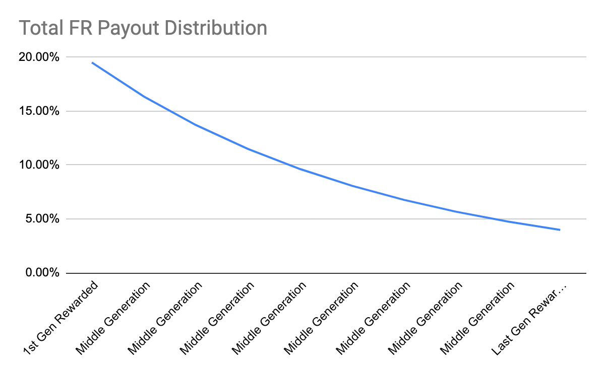

# 📃 Whitepaper

<mark style="color:red;">**more for you is also more for me™**</mark>

<figure><figcaption></figcaption></figure>

by Yale ReiSoleil, @dRadiant, D Wang, PhD

July 2023

_v. 1.6.9 beta_

## Disclaimer <a href="#h.17v05jnu7qff" id="h.17v05jnu7qff"></a>


This paper is for general information purposes only. It does not constitute investment advice or a recommendation or solicitation to buy or sell any investment and should not be used in the evaluation of the merits of making any investment decision. It should not be relied upon for accounting, legal or tax advice, or investment recommendations. This paper reflects the current opinions of the authors. The opinions reflected herein are subject to change without being updated.


## Abstract

### untrading.org in One Sentence

In one short sentence:

> [_**untrading.org**_](https://untrading.org) _**is a commission-free crypto investment protocol that enables token owners to participate in future price increases, even after selling their tokens.**_

untrading.org brings a revolutionary approach to trading, where token owners can continue to benefit from future price increases, even after selling their tokens. Unlike fee-based transaction models, untrading.org does not profit from users' losses, ensuring a fair and transparent trading environment. By prioritizing users' success and eliminating the zero-sum mentality, untrading.org creates a community-driven platform that promotes collective wealth and long-term prosperity.

In more detail, here is what untrading.org is all about:

> [_**untrading.org**_](https://untrading.org/) _**is a revolutionary commission-free crypto investment protocol utilizing**_ [_**ERC-5173**_](https://eips.ethereum.org/EIPS/eip-5173)_**, on-chain payments & licenses, a truly divisible NFT framework, and an upgradable multisignature contract protocol to create a participatory value amplification system, enabling token owners to benefit from future price increases even after selling their tokens, while eliminating conflicts of interest and promoting fairness and transparency in the asset transaction industry.**_

untrading.org is not just another trading platform. It is a revolutionary commission-free crypto investment protocol that disrupts the traditional trading model. At its core is the implementation of ERC-5173, a groundbreaking solution that brings about a paradigm shift in the trading landscape.

With untrading.org, token owners have the unique advantage of participating in future price increases, even after they have sold their tokens. This is made possible through the innovative Flow created by ERC-5173. Unlike conventional exchanges that focus solely on immediate gains, Untrading.org ensures that investors can continue to reap the rewards of their initial investment over time.&#x20;

But untrading.org goes beyond just financial gains. It fundamentally transforms the trading experience by eliminating conflicts of interest and the zero-sum mentality prevalent in traditional platforms. By implementing a trustless Flow among creators, buyers, and sellers, untrading.org fosters collaboration, transparency, and shared prosperity.&#x20;

Through the advanced NFT framework powered by ERC-5173, untrading.org offers a new dimension to asset transactions. It creates a dynamic ecosystem where every participant benefits and contributes to collective wealth creation. The result is a community-driven platform that aligns the interests of all users and empowers them to build a more sustainable and beneficial trading environment.&#x20;

untrading.org stands apart from fee-based platforms that profit from users' losses. It is a platform designed to prioritize the success and interests of its users. By embracing ERC-5173 and its innovative approach, Untrading.org reshapes the way we think about trading, opening up new possibilities and opportunities for investors.&#x20;

Experience the future of trading with untrading.org, where commission-free investing and participation in future price increases are not just promises but a reality. Join us today and be a part of the financial revolution that puts your success and prosperity first.

### untrading.org in One Picture

<figure><figcaption><p><a href="https://docs.untrading.org/nfr-distribution">https://docs.untrading.org/nfr-distribution</a></p></figcaption></figure>

Imagine selling ETH on untrading.org for $1,900 and its price increases to $4,000 later, you receive several payments that include portions of the $2,100 increase.

No more zero-sum trading. &#x20;

### **untrading.org in** 200 Words

The following is a more comprehensive description that includes several key elements of the new trading platform architecture:

> [_untrading.org_](https://untrading.org/)_, a revolutionary asset transaction protocol on the Ethereum and Polygon networks, employs ERC-5173, the innovative Non-fungible Future Rewards (nFR) framework, as the foundation of its Participatory Value Amplification (PVA) model. This groundbreaking approach empowers token holders to actively participate in future price increases, even after selling their tokens, with resilient rewards distributed through an on-chain payment mechanism._
>
> _By eliminating commissions, untrading.org fosters a collaborative wealth creation ecosystem, aligning the interests of token holders. User asset protection is ensured through the implementation of multi-signature contracts._
>
> _The platform revolutionizes the industry by seamlessly integrating buyer and seller information into time and sales (T\&S) data, enhancing transparency, value, and security throughout the asset transaction process._
>
> _Additionally, untrading.org introduces a cutting-edge divisible NFT framework, merging the strengths of_ [_ERC-20_](https://eips.ethereum.org/EIPS/eip-20) _and_ [_ERC-721_](https://eips.ethereum.org/EIPS/eip-721) _standards. This framework enables efficient fractional token transfers and offers optimization opportunities for managing DAO treasuries._
>
> _With its commitment to continuous improvement, untrading.org ensures the platform's security and adaptability through upgradable smart contract deployment. By challenging the long-standing norms of traditional asset exchanges, untrading.org explores transformative possibilities for the industry._
>
> _Join untrading.org today and be part of the future of inclusive and transparent asset trading._

The paper will discuss the foundations of the untrading protocol. A number of new financial innovations have recently emerged, but not all of them offer the same features as untrading.org.

\_\_\_\_\_\_\_\_\_\_\_\_\_\_\_\_\_\_\_\_\_\_\_\_\_\_

We would like to thank the following reviewers, whose contributions and feedback made this document possible:

Simon Telfer

Francois Baechtold

\_\_\_\_\_\_\_\_\_\_\_\_\_\_\_\_\_\_\_\_\_\_\_\_\_\_\_


## <mark style="color:red;">01</mark>        Introduction <a href="#h.5php9w692ai5" id="h.5php9w692ai5"></a>

Throughout history, the trading industry has been highly profitable for financial operators, while ordinary traders often face devastating consequences. Promised easy money, many fall victim to a zero-sum game, leaving their lives and savings shattered. But the challenges go beyond high fees. Unethical practices by platforms, insiders, and market manipulators have undermined trust in the system. Insider trading, frontrunning, and price manipulation are just a few tactics employed to exploit others and extract maximum value. As a result, individual traders endure substantial losses, and the integrity of the financial system suffers.

### Why Do People Trade?

Despite the well-known fact that the majority of traders face substantial losses, many are still enticed by the allure of quick and effortless wealth. Online trading platforms and mobile apps have made market access easier, even for those lacking the necessary experience and knowledge. However, successful trading requires expertise and discipline.

#### Initial Confidence and Overconfidence Bias

People may engage in trading due to initial confidence and perceived intelligence. Yet, studies reveal a prevalent overconfidence bias in finance and trading. Despite the reality that only a small percentage of traders achieve significant success, many consistently rate themselves as top performers. Trading may appear deceptively simple, but true success requires more than just buying low and selling high.

#### The Allure of a Large Sum

The possibility of a substantial windfall motivates individuals to participate in trading and gambling. Media coverage of market winners creates the impression that anyone can achieve similar success. However, it is crucial to recognize that exceptional profits are often a combination of skill and luck, not the norm.

#### The Thrill of Pattern Recognition

Despite high failure rates, trading offers a challenge and the opportunity to uncover patterns in complex financial markets. This pursuit can provide a sense of satisfaction and accomplishment, even in the face of repeated losses.

#### Distrust in the Financial System

Some individuals choose to trade independently due to a lack of trust in financial institutions. Scandals involving unethical behavior and profit-seeking by these institutions have eroded confidence in the financial system. Concerns regarding conflicts of interest and high fees also drive some to opt for self-directed trading, granting greater control over investment decisions.

#### ERC-5173: Paving the Way for a Fairer Financial Protocol

A proposed protocol called ERC-5173, introduced by untrading.org, aims to challenge the prevailing zero-sum mentality in finance. Its objective is to establish a cooperative and mutually beneficial trading environment where collective market success benefits all participants. By shifting the paradigm, ERC-5173 seeks to foster a more equitable and sustainable financial ecosystem.

\
\_\_\_\_\_\_\_\_\_\_\_\_\_\_\_\_\_\_\_\_\_\_\_

_This paper is organized into five sections. The remainder of this introduction provides a brief history of the current financial trading system and explains why trading can be considered a zero-sum game. The introduction then discusses why on-chain, trustless Flows can be created to end both the conflicts of interest between exchanges and their users, and as a way of ending the zero-sum game and converting it into a positive-sum game, and the use cases We describe and analyze the architecture of untrading.org in section 2. In section 3, the specific functions and mathematical formula for Future Rewards distribution are described in detail, along with the open-source Solidity code. In section 4, we discuss the security risks and fundamental challenges facing untrading.org. We also discuss specific vulnerabilities that could make this entire business concept useless if not addressed properly. A short summary concludes the paper in section 5._

### <mark style="color:blue;">1.1</mark>        Philosophy <a href="#h.kplu6gt7s2fs" id="h.kplu6gt7s2fs"></a>

> _"In capitalism, man exploits man. In communism, it's the opposite."_&#x20;
>
> — John Kenneth Galbraith

Throughout the evolution of biology and human society, increasing connectivity has been a defining characteristic. However, modern economies and markets have taken a different path, leading to greater separation and fragmentation. This has resulted in isolation and a concentration of wealth, creating a stark contrast with the principles of interconnectedness seen in biology and traditional human society.

To build a sustainable and equitable future, we must embrace a shared economic system that prioritizes collective success, happiness, and sustainability. Such a system values fairness, equality, and recognizes the inherent interdependence of individuals and communities. It encourages long-term thinking and planning, rather than a short-sighted pursuit of individual gains.

In contrast, a winner-takes-all mentality fosters social and economic inequality, leading to social unrest, conflict, and a disregard for long-term sustainability. To foster a more just and harmonious society, we need a shared economics system that promotes social justice, acknowledges interdependence, and encourages long-term perspectives. This will pave the way for a more equitable, balanced, and sustainable future.

### <mark style="color:blue;">1.2</mark>        History <a href="#h.kplu6gt7s2fs" id="h.kplu6gt7s2fs"></a>

The current financial system is plagued by fraudulent techniques that exploit both the market and its participants. Techniques like spoofing, insider trading, front running, wash trading, and pump and dump create an uneven playing field where most traders are at a disadvantage. These practices, driven by emotions like greed and fear, ensure that the majority of participants will ultimately lose money.

Cryptocurrency-related fraud cases have seen a significant increase, with a particular vulnerability among individuals over 50 years of age who are new to investing, according to the North American Securities Administrators Association. These fraudulent activities extend beyond cryptocurrencies and also affect traditional financial markets.

Adding insult to injury, traders are burdened with various fees, including commissions, margin fees, interest, markups, funding fees, deposit fees, transfer fees, and withdrawal fees. These fees penalize traders regardless of their profitability, creating a system that benefits the exchange and the elite few at the expense of the majority.

This structure has perpetuated the transfer of wealth from the masses to a privileged group that holds political and commercial control. Studies show that around 90% of traders lose a significant portion, if not all, of their trading capital, leaving them trapped in a system that drains economic vitality.

The current financial system has been designed to serve the interests of the wealthiest, prioritizing the exchange's profits over customer success. Research from the University of California reveals that only about 13% of day traders consistently earn profits, leaving the majority at a loss. Even the DeFi model, with its fixed 3% commission, perpetuates this historic imbalance in an automated and extended fashion.

### <mark style="color:blue;">1.3</mark>       Rationale <a href="#h.2hsns6abcaef" id="h.2hsns6abcaef"></a>

The history of trading markets has been marred by an unequal distribution of value, but the advent of non-fungible tokens (NFTs) and the Flow blockchain presents an opportunity for a more equitable system.

The Future Rewards (FRs) framework is at the core of a user-centric shared economics ecosystem. It introduces a new model for (un)trading that is built on success and ensures alignment among all participants. In this framework, there is no zero-sum game, as everyone is incentivized to create value, fostering a system that benefits all stakeholders.

The shared economics ecosystem promotes fairness and equality in trading by discouraging the harmful practices that have plagued the industry. It ensures fair compensation for artists and creators through a lifetime royalty system, similar to established practices in the recording industry.

Moreover, the Flow ecosystem provides relief for traders who have experienced losses. It offers a fresh and exciting approach to trading while upholding fairness and equality in the marketplace.

With the aim of aligning the interests of all parties - the protocol, buyers, and sellers - untrading.org establishes a positive gift economy that rewards and incentivizes participants fairly. The platform seeks to bring a touch of magic and excitement to the world of (un)trading. The non-fungible Future Reward (nFR) framework is an integral part of this effort to create a new paradigm that fosters fairness and equality in trading.

### <mark style="color:blue;">1.4</mark>        Introducing A Participatory Value Amplification (PVA) Framework <a href="#h.s6ava0wuzykt" id="h.s6ava0wuzykt"></a>

The PVA Framework combines the best aspects of investment and trading, offering the flexibility and control of traditional trading alongside the rewards and benefits of a lifetime royalty system. With untrading.org, you are not compelled to trade for platform fees and can hold onto your high-quality assets for as long as you desire. Even if you choose to sell, you can still receive a portion of future profits if the price continues to rise. Join the Flow community today to experience these advantages.

Operating on the principles of giving and receiving, the PVA Framework emphasizes community interdependence and delayed reciprocity. Unlike traditional trading platforms, the Flow does not adhere to a quid pro quo system. Instead, it embraces the concept that when others succeed, you benefit even more. Within this circle of giving, participants may receive more than they give over time. This shared objective transforms the traditional dynamics of platform versus user and user versus user relationships into a unified objective.

### <mark style="color:blue;">1.6</mark>        Pay Only After Making a Profit <a href="#h.x5hek4s7c18r" id="h.x5hek4s7c18r"></a>

At untrading.org, we advocate for trading platforms that do not charge users for losses. Instead, we have adopted a hedge fund-inspired incentive fee model where users only pay if their transactions are profitable.

With the PVA Framework, there are no commissions, deposit fees, transfer fees, or withdrawal fees. Instead, we share a small portion of a user's profit with the Minters as o-token holders, generating revenue.

This approach not only creates a more equitable trading environment but also discourages any unauthorized deals that could violate the rules set by artists, creators, and marketplaces. Join the Flow today for a new way of trading where you pay only after making a profit.

Join the PVA Framework and become part of a fair trading system that prioritizes community and shared goals.

### <mark style="color:blue;">1.7</mark>        Use Cases <a href="#h.o4p39l4e3q7k" id="h.o4p39l4e3q7k"></a>

#### **Original NFT**

Users can mint and list artworks on untrading.org to receive two types of tokens simultaneously, the unNFT tokens for trading and the unlisted o-tokens for receiving royalty payments. Minters receive additional Future Rewards distributions if they sell their unNFTs as first generation owners.

#### **Third-party NFT wrapping**

The untrading.org platform allows users to wrap existing NFTs they have purchased from any other marketplace and upgrade them into unNFTs. Minters who wrap the existing NFTs are now both the originators and owners on the untrading.org platform and will receive both the new royalty payments and the FR distributions.

#### **Applications**

The untrading.org script language will allow the development of applications to handle a wide range of trading capabilities, including trading on centralized and decentralized marketplaces, derivative issuance, and trading handled by regulated transfer agents, among others. This allows any unNFT to be traded on third-party marketplaces and exchanges.

#### **Content Curation**

Users of untrading.org can gather around collections, styles, and art movements of shared interests.

#### **Social**

Groups that currently gather in online forums, chat groups, online trading analytical websites, or even other centralized marketplaces could port their communities into untrading.org.

#### **Financial derivatives**

Major cryptocurrencies such as Bitcoin, Ethereum, and SOL can be upgraded into un-token standard derivatives on untrading.org. In addition, other traditional financial assets, such as stocks, real estate, and any other quoted securities, may also be converted into derivatives by utilizing third-party custodians and transfer agents. &#x20;

**DAO Native Tokens and Treasury Management**

As there are no technical specifications governing what can be wrapped for listing and trading on untrading.org, there may be additional use cases involving upgrading the startup funding methods. The founders of startup projects may use untrading.org to raise funds. The founders, team members, and advisors receive o-tokens, but only the paying investors receive un-tokens. The team is considered the Minter, and will receive royalties perpetually from the success of the project whenever an un-token holder, the investor, makes a profit.

The investors' confidence in the new funding increases since the founders' financial incentives are truly linked to the investor's profitability, in addition, rug-pulling is prevented.

### <mark style="color:blue;">1.8</mark>        Definitions <a href="#h.o4p39l4e3q7k" id="h.o4p39l4e3q7k"></a>

**Non-fungible Future Reward Protocol (nFR):** Also known as Ethereum Improvement Proposal (EIP-5173), nFR is an ERC721 token extension that  enables owners of EIP-721 tokens (NFTs) to participate in future price increases after they sell their tokens, resulting in more for you is also more for me.

**Participatory Value Amplification (PVA) Framework:** The Participatory Value Amplification (PVA) Framework is a trading and investment framework implemented by untrading.org. It aims to create a more equitable and inclusive trading environment by prioritizing shared value creation and fairness among participants. Under the PVA Framework, the interests of all stakeholders, including platform users, creators, and marketplaces, are aligned to promote mutual success. It operates on the principles of interdependence and delayed reciprocity, fostering a sense of community and cooperation. Unlike traditional trading platforms, which often operate on a transactional basis, the PVA Framework emphasizes the concept of giving and receiving. It recognizes that when others in the community succeed, individual participants can also benefit more in the long run. Through this framework, participants are encouraged to hold high-quality assets and are not pressured to engage in excessive trading. The framework allows users to share in future profits even after selling their assets, ensuring a continued vested interest in the success of the community and the assets they have traded. By embracing the Participatory Value Amplification Framework, untrading.org seeks to redefine the relationship between trading platforms and users, fostering a more cooperative and mutually beneficial approach to trading and investment.

**Flow:** Each unNFT token under EIP-5173 has its own Flow, a unique "mini community" consists of its previous and current owners. Every cryptocurrency pair has its own Flow, so unNFT tokens can have multiple Flows. Each member gives and receives Future Rewards (FRs) generated by the new trading profits of each token.

**Minting:** Minting on untrading.org is to create an nFR-compliant unNFT. In the same way as any other NFT minting process, the art piece is minted as an NFT with an additional asset called o-tokens that are distributed to the Minter and untrading.org for receiving royalties (ORs) from unNFT profits.

**Wrapping:** Untrading.org offers wrapping for blue-chip NFT upgrades from third parties. In addition to artists and creators minting their artwork on the protocol, anyone can wrap an existing valuable NFT they bought from any marketplace they have in their collection as an unNFT of the same value, backed by the original NFT, on untrading.org as an unNFT of the same value. The procedure is enhanced by additional steps and safekeeping measures.

**Rewards (R):** A portion of the net profit from the sale of an unNFT is set aside for Future Rewards sharing. This is called Rewards (R). The remainder is the seller's profit.

**o-token:** Aside from listed tokens, o-tokens also are issued to artists if they are minting or wrapping an NFT on untrading.org. Owners of o-tokens are entitled to receive royalties.&#x20;

**Originators’ Rewards (ORs):** The Rewards (R) are divided into two portions: For the profits distributed to Minters and former owners. As a result, the artists will receive a fixed portion of all future owners' profits, known as the Originator Rewards (OR). The remaining profits are shared with previous owners and buyers, known as the Future Rewards (FR).&#x20;

**un-token:** An NFT token minted on untrading.org under EIP-5173. It bears a prefix of “un.”

**Future Rewards (FRs):** A multigenerational reward mechanism of Flows that rewards‌ all ‌owners of non-fungible tokens (NFT), the Future Rewards (FR) extension is introduced that will allow owners of unNFT tokens to participate in future investment profits derived from the same token by later investors in the same chain of ownership. R minus OR is the remainder of the buyers', or owners', Future Rewards.

**Generations:** The numbered sequence of the current and previous token owners within the sliding window mechanism (n) that are currently eligible for FRs distribution. It determines which previous owners will receive distributions. The owners are arranged in a queue, starting with the earliest owner and ending with the owner immediately before the current owner (the Last Generation). The First Generation is the last of the next n generations. There is a fixed-size profit distribution window from the First Generation to the Last Generation. The sliding window (w) itself is called an Epoch.&#x20;

**Total nFR Paid:** The number of ORs and FRs an active un-token has generated for its creator, all previous owners, and its current owner. In contrast to the traditional Daily Volume and Total Trading Volume that are mostly self-serving exchange metrics, the Total nFR Paid is one of the most important protocol success metrics for untrading.org. This metric is listed on every minted unNFT details page.

## <mark style="color:red;">02</mark>        Architecture <a href="#h.dn642dhamgzt" id="h.dn642dhamgzt"></a>

For each listed token, the untrading.org protocol consists of two or three tokens: 1) the main listed un-token, and it is always accompanied by 2) the unlisted minter, or creator token, the o-token, and 3) if the un-token is backed by an existing third-party NFT the Minter owns, the third-party NFT locked in the escrow contract’s multisig, multi-party vault.

### <mark style="color:blue;">2.1</mark>        The o-tokens <a href="#h.v2ngx7e84l7r" id="h.v2ngx7e84l7r"></a>

Aside from listed tokens, o-tokens also are issued to artists if they are minting an original NFT, and to the owner of a blue-chip NFT as the Minter on untrading.org. Owners of o-tokens are entitled to receive royalties.

A portion of the net profit from the sale of an unNFT is set aside for Future Rewards sharing. This is called Rewards (R). The remainder is the seller's profit.

Additionally, the Rewards (R) are divided into two (2) portions: For the profits distributed to Minters and former owners. As a result, the artists will receive a fixed portion of all future owners' profits, known as the Originator Rewards (OR). The remaining profits are shared with previous owners and buyers, known as the Future Rewards (FR).

Within these ranges, the Minter can set the total Rewards ratio and the Originator Reward ratio:

| Rewards (R) ratio of total Profit | _f_ | 5% - 50% |
| --------------------------------- | --- | -------: |
| Originator Reward (OR) ratio      | _a_ | 5% - 50% |

Although it is the Minter's privilege to set these ratios, setting these ratios too high or too low may make the unNFT undesirable to potential purchasers.

* Default values for f and a when minting original art unNFTs are 35% and 60%, respectively;
* NFT wrapping uses f as 15% and a as 20% by default.

The royalty portion of the profit-sharing plan will be partially based on EIP-2981 \[1] and some functionalities in the draft proposal of EIP-4910 \[2]. The untrading.org protocol will implement an improved on-chain, cross-platform royalty payment mechanism with the introduction of an o-token.

### <mark style="color:blue;">2.2</mark>        The un-tokens <a href="#h.jil64evym007" id="h.jil64evym007"></a>

As a result of the minting process described below, untrading.org non-fungible tokens bear a prefix of "un."

R minus OR is the remainder of the buyers', or owners', Future Rewards.

#### **Future Rewards calculation**&#x20;

The Minter can also define a sliding window mechanism to decide which previous owners will be involved in the profit distribution. Let's imagine the owners as a queue starting from the firsthand owner to the current owner. The profit distribution window starts from the previous owner immediately to the current owner and extends towards the first owner, and the size of the windows is fixed. Only previous owners located inside the window will join the profit distribution. &#x20;

The total number of generations of owners in the sliding window is set by the Minter.

| Generations of Owners receiving FRs | _w_ | 5 - 20 |
| ----------------------------------- | --- | -----: |

* The default value of w is 10.

#### **Rewards formula**


In this equation:

* P is the total profit;
* _f_ is reward ratio
* _r_ is buyer reward ratio of the total P
* _a_ is originator reward ratio
* _b_ is buyer reward ratio of the total P, and b = 1 – a
* w is the window size, i.e. the maximum number of layers eligible for profit distribution
* _g_ is the common ratio of successive in the geometric sequence
* _m_ is the total number of all owners of a token
* _n_ is the actual number of owners eligible in the profit distributions. To calculate the formula value of _n_, we have _n_ = min(_m, w_), and _w_ is the window size of the profit distribution sliding window algorithm, , set by the Minter when minting the unNFT.

The buyers/owners receive a portion ( _r_ ) of the realized profit  (P ) from an NFT transaction. The remaining proceeds go to the seller.

As a result of defining a sliding window mechanism ( _n_ ), we can determine which previous owners will receive distributions. The owners are arranged in a queue, starting with the earliest owner and ending with the owner immediately before the current owner (the Last Generation). The First Generation is the last of the next n generations. There is a fixed-size profit distribution window from the First Generation to the Last Generation.

The profit distribution shall be only available to previous owners who fall within the window. &#x20;



In the example in _Figure 1_, there is a portion of the proceeds awarded to the Last Generation owner (the owner immediately prior to the current seller) based on the geometric sequence in which profits are distributed. The larger portion of the proceeds shall go to the Mid-Gen owners, the earlier the greater, until the last eligible owner is determined by the sliding window, the First Generation. Owners who purchase earlier will receive a greater reward, with first-generation owners receiving the greatest reward.

**Price history example**

_Figure. 2_ and _Table 1_ illustrate the price history of a 10-generation distribution unNFT token. We will examine the sharing and receiving of FRs by Owner #3.


Owning the token for $200, selling it for $400, and then sharing the $200 profit with the creator/minter, untrading.org, the o-token holders collectively, as ORs, and Owner #2 and #1 as FRs is your responsibility when you are Owner #3. As of Owner #6, all transactions have been sold and purchased at lower prices. This price is the highest ever for a period of time. Until Owner #6, no transactions had been sold or bought at lower prices. This is the highest price ever for a period of time.

|           |        |
| --------- | -----: |
| Owner     |  Price |
| Owner #10 | $1,000 |
| Owner #9  |   $700 |
| Owner #8  |   $600 |
| Owner #7  |   $450 |
| Owner #6  |    $60 |
| Owner #5  |    $70 |
| Owner #4  |    $50 |
| Owner #3  |   $400 |
| Owner #2  |   $200 |
| Owner #1  |   $100 |

_Table 1: Price History_

Owning the token for $200, selling it for $400, and then sharing the $200 profit with the creator/minter, untrading.org, the o-token holders collectively, as ORs, and Owner #2 and #1 as FRs is your responsibility when you are Owner #3. As of Owner #6, all transactions have been sold and purchased at lower prices. This price is the highest ever for a period of time. Until Owner #6, no transactions had been sold or bought at lower prices. This is the highest price ever for a period of time.

Owner #4 purchased for $400, sold to Owner #5 for $50 at a loss. Owner #4 will not be paying any buying or selling commissions. They do not pay any royalty to the o-token holders or FRs to Owner #1, #2 or you, #3 as they lost money. Owner #5 purchased the unNFT for $50 and sold it for $70. A royalty payment will be made to the holders of the o-tokens and FRs will be provided to Owner #1, #2, you, and Owner #4, although the amount is quite small.

Owner #6 also lost money, but it was a smaller loss than owner #4's. This sale does not pay out to anyone.

It was, however, a great success for Owner #7. Their purchase of the property was for $60 and subsequently sold for $450, an all-time high (ATH). Based on their profit of $390, they will pay royalties to the o-token holders and all the unNFT token holders before them: Owners #1, #2, you, #4, #5, and #6. &#x20;

In the event that the unNFT continues to make ATHs, any new profits realized by the new owners, #7, #8, #9, and #10, will be shared with all the previous generations of owners, including yourself.

Even for Owner #4, the biggest loser in our example, the FRs received from #5, #7, #8, #9, and #10 could be substantial.

See Table 2 in the Specification section for a detailed illustration.

### <mark style="color:blue;">2.3</mark>        Minting <a href="#h.ocqixsbeplyi" id="h.ocqixsbeplyi"></a>

On untrading.org, users can mint original artwork or wrap existing NFTs into nFR-compliant unNFTs.

_Figure 3_ shows how an original piece is minted on untrading.org as an nFR-compliant unNFT. In the same way as any other NFT minting process, this art piece is minted as an NFT with an additional asset called o- tokens that are distributed to the Minter and untrading.org for receiving royalties from unNFT profits.

#### **Original NFT Minting**


Royalties and platform’s share are as follows:

| Minter's share of OR        | _b_ | 70% |
| --------------------------- | --- | --: |
| untrading.org's share of OR |     | 30% |

untrading.org receives a small number of o- tokens from each unNFT minted on the platform. This is the only financial benefit the platform receives.

#### **Third-party blue-chip NFT Wrapping**


In addition for an artist and creator to mint their artwork on the platform, anyone can wrap an existing valuable NFT they bought from any marketplace in their collection on untrading.org as an unNFT of the same value, backed by the original NFT  (See _Figure 4_). Additional steps and safe-keeping measures are implemented.

**Pre-approved collections**

Untrading.org sets a list of pre-approved collections that we allow for wrapping and derivative trading during beta testing.

By wrapping an existing blue-chip NFT on the untrading.org platform, the smart contract will check and authenticate that it is in its pre-approved collections.

**Custody of the original NFTs**

When a user wraps their third-party existing NFT into an unNFT, the NFT they own is transferred to the unNFT smart contract. Once the unNFT is listed, the user can unlist and then unwrap it, and take back the underlying NFT, at any time. Listing, unlisting, and escrow are handled directly by the unNFT smart contract. It is, however, no longer possible for the Minter to unwrap the unNFT once a sale agreement has been reached between buyer and seller.

**Unwrapping**

No one, not even the untrading.org platform and their employees, can unilaterally unwrap an unNFT.


The untrading.org platform or the new owner of unNFT can initiate an unwrapping request in certain circumstances. The original Minter and all previous owners would be adversely affected if the original NFT was unwrapped and released to the current unNFT owner. On iob.fi DAO voting, the Minter and all affected previous owners must approve the process within the sliding window (see description in the Specification section). Aye votes will instruct the third party to sign the vault and unwrap the original NFT.

Extreme FR percentage settings can result in the unNFT being rejected by the market if the Minter sets them too large or too small. This can make the particular unNFT unsellable in competitive markets. If this is the case, the current owner or untrading.org can propose to unwrap the unNFT. &#x20;

In the event an unwrapping resolution is passed, a multisignature-unwrapping signing process is triggered and will undergo inside the unNFT smart contract. For the unwrapping to be successful, 2 of 3 approval signatures will have to be made: one by the current holder of the unNFT and either one by the untrading.org platform or the third-party institutional custodian (see _Figure 5_). The underlying NFT will be released to the last unNFT holder who has co-signed the unwrapping agreement.

The unNFT smart contract multisig component is built in combination with Gnosis Safe smart contracts.

### <mark style="color:blue;">2.4</mark>        Burning <a href="#h.bio675l31tr" id="h.bio675l31tr"></a>

Burning refers to the action of redeeming unNFT for the underlying NFT tokens. Only if the unwrapping process was approved can the unNFT tokens be burnt. In order to do so, the burn function is called in the contract with the number of tokens to be burnt on the Ethereum chain. By doing so, the amount is deducted from the unNFT balance (on-chain) held by the last owner’s wallet.&#x20;

Additionally, the o-tokens associated with the unNFT will also be burnt on the blockchain.

## <mark style="color:red;">03</mark>        Specification <a href="#h.sdzwoztnri38" id="h.sdzwoztnri38"></a>

We are implementing our EIP-5173 extension using the ERC721 standard, with additional extensions proposed by EIP-2981 and EIP-4910 for on-chain royalty distribution.

```
pragma solidity ^0.8.0;

import "@openzeppelin/contracts/utils/introspection/IERC165.sol";

/* *
@dev Interface for the Future Rewards Token Standard.

A standardized way to receive future rewards for non-fungible tokens (NFTs.)

*/ 
interface InFR is IERC165 {

    event FRClaimed(address indexed account, uint256 indexed amount);

    event FRDistributed(uint256 indexed tokenId, uint256 indexed soldPrice, uint256 indexed allocatedFR);

    function list(uint256 tokenId, uint256 salePrice) external;

    function unlist(uint256 tokenId) external;

    function buy(uint256 tokenId) payable external;

    function releaseFR(address payable account) external;

    function retrieveFRInfo(uint256 tokenId) external returns(uint8, uint256, uint256, uint256, uint256, address[] memory);

    function retrieveAllottedFR(address account) external returns(uint256);

    function retrieveListInfo(uint256 tokenId) external returns(uint256, address, bool);

}

interface IERC165 { 
    /// @notice Query if a contract implements an interface 
    /// @param interfaceID The interface identifier, as specified in ERC-165 
    /// @dev Interface identification is specified in ERC-165. This function 
    /// uses less than 30,000 gas. 
    /// @return true if the contract implements interfaceID and 
    /// interfaceID is not 0xffffffff, false otherwise 
    function supportsInterface(bytes4 interfaceID) external view returns (bool); 
}
```

Each Token ID is updated. The data in the `FRInfo` struct is stored wholly in a single mapping. The struct is exposed in a public mapping with functions for accessing data. This is for client-side data fetching and verification.

```
struct FRInfo {
        uint8 numGenerations; //  Number of generations corresponding to that Token ID
        uint256 percentOfProfit; // Percent of profit allocated for FR, scaled by 1e18
        uint256 successiveRatio; // The common ratio of successive in the geometric sequence, used for distribution calculation
        uint256 lastSoldPrice; // Last sale price in ETH mantissa
        uint256 ownerAmount; // Amount of owners the Token ID has seen
        address[] addressesInFR; // The addresses currently in the FR cycle
}

struct ListInfo {
        uint256 salePrice; // ETH mantissa of the listed selling price
        address lister; // Owner/Lister of the Token
        bool isListed; // Boolean indicating whether the Token is listed or not
}
```

Additionally, there exists a `ListInfo` struct mapping with a corresponding function to retrieve its contents for each token ID.&#x20;

The amount of Ether allocated to a specific address using the `_allottedFR` mapping is constantly updated. The `_allottedFR` mapping is either public or has a function to fetch the FR payment allotted to a specific address.

### <mark style="color:blue;">3.1</mark>        Percent Fixed Point <a href="#h.7xn6jwxzmyty" id="h.7xn6jwxzmyty"></a>

The `allocatedFR` is calculated using a percentage fixed point with a scaling factor of 1e18 (X/1e18) - such as "5e16" - for 5%. This is to maintain uniformity across the standard. The max and min values would be – 1e18 - 1.

### <mark style="color:blue;">3.2</mark>        Default FR Info <a href="#h.p667888cftma" id="h.p667888cftma"></a>

A default `FRInfo` is stored in order to be backward compatible with ERC721 mint functions. It also has a function to update the `FRInfo`, assuming it has not been hard-coded.

### <mark style="color:blue;">**3.3**</mark>**       EIP-2535 Diamonds Upgradability and Modularity**

The codebase is broken up into facets with their respective facet storages using the Diamond storage pattern as defined in [EIP-2535](https://eips.ethereum.org/EIPS/eip-2535). The central diamond serves as the core contract and stores all of the contract data. This allows the entire contract’s functionality to be completely upgradable and modular. As the diamond contract has no functions but rather references a deployment of a facet. An access system is implemented which allows a designated address (or contract) to call the `diamondCut` function to modify the contract.

### <mark style="color:blue;">3.4</mark>      o-tokends

Whenever a token is minted o-tokens will be distributed between the platform and the minter with `_distributeOTokens` internally. Balances and info for a given token ID can be retrieved with `retrieveORInfo` and `balanceOfOTokens`. OR rewards for a given address can be retrieved with `retrieveAllottedOR` and claimed with `releaseOR`. Additionally, `transferOTokens` can be used to transfer one’s o-tokens. Finally, whenever a profitable sale has been made `_distributeOR` is triggered.

### <mark style="color:blue;">3.5</mark>       On-chain Licensing

Implementing a16z’s [CantBeEvil licensing](https://a16zcrypto.com/introducing-nft-licenses/) with a per-token ID modification allows each NFT minted on our contracts to have an immutable and on-chain license. Whenever each token is minted a license type is provided, which is then able to be retrieved at any time for that specific token ID with `getLicenseName` and `getLicenseURI`.

### <mark style="color:blue;">3.</mark><mark style="color:blue;">**6**</mark>        ERC721 Overrides <a href="#h.muwvdcauc8v2" id="h.muwvdcauc8v2"></a>

We override the ERC721 `_mint`, `_transfer`, and `_burn` functions. When overriding the `_mint`  function, a default FR model is established if the mint is to succeed when calling the ERC721 `_mint` function and not the nFR `_mint`  function. It is also to update the owner amount and directly add the recipient address to the FR cycle. When overriding the `_transfer` function, the smart contract will consider the NFT as sold for 0 ETH, and update state accordingly after a successful transfer. This is to prevent FR circumvention. Finally, when overriding the `_burn` function, the smart contract deletes the `FRInfo` corresponding to that Token ID after a successful burn.

Additionally, the ERC721 `_checkOnERC721Received` function is explicitly called after mints and transfers if the smart contract aims to have safe transfers and mints.

### <mark style="color:blue;">3.7</mark>        Safe Transfers <a href="#h.y5c8t8wqgv57" id="h.y5c8t8wqgv57"></a>

If the wallet/broker/auction application will accept safe transfers, then it  implements the ERC721 wallet interface.

### <mark style="color:blue;">3.8</mark>        Listing, Unlisting, and Buying <a href="#h.epik9qj3qr61" id="h.epik9qj3qr61"></a>

The `list`, `unlist`, and `buy` functions are implemented, and they provide the capability to sell a token.

```
function list(uint256 tokenId, uint256 salePrice) public virtual override {
   //...
}

function unlist(uint256 tokenId) public virtual override {
   //...
}

function buy(uint256 tokenId) public virtual override payable {
   //...
}
```

The `list` function accepts a `tokenId` and a `salePrice` and updates the corresponding `ListInfo` for that given `tokenId` after ensuring that the `msg.sender` is either approved or the owner of the token. The function signifies that the token is listed and at what price it is listed for.

The `unlist` function accepts a `tokenId` and it deletes the corresponding `ListInfo` after the owner verifications have been met.

The `buy` function accepts a `tokenId` and is payable. It verifies that the `msg.value` matches the token’s `salePrice` and that the token is listed, before proceeding and calling the FR `_transferFrom` function. This is to ensure the values are valid and will also allow for the necessary FR to be held in the contract.

### <mark style="color:blue;">3.9</mark>        Future Rewards  `_transferFrom`  Function

The FR `transferFrom` function is called. It ensures backward compatibility for secondary platforms that do not support our nFR standard.&#x20;

```
function _transferFrom(address from, address to, uint256 tokenId, uint256 soldPrice) internal virtual {
       //...
}
```

Based on the stored `lastSoldPrice`, the smart contract will determine whether the sale was profitable after calling the ERC721 transfer function and transferring the NFT. If it was not profitable, the smart contract updates the last sold price for the corresponding Token ID, increments the owner amount, shifts the generations, and transfers all of the `msg.value` to the `lister` depending on the implementation. Otherwise, if the transaction was profitable, the smart contract calls the `_distributeFR` function, then updates the `lastSoldPrice`, increments the owner amount, and finally shifts generations. The `_distributeFR` function returns the difference between the allocated FR that is to be distributed amongst the `_addressesInFR` and the `msg.value` to the `lister`.

### <mark style="color:blue;">3.10</mark>        Distribution of NFT Royalties to Artists and Creators <a href="#h.94w0lmnqe8uq" id="h.94w0lmnqe8uq"></a>

#### **On-chain royalty distribution**

We agree that artists’ royalties should be uniform and on-chain. We support both [EIP-4910](https://www.google.com/url?q=https://github.com/ethereum/EIPs/pull/4910/commits/8fd87b4ec3dbfce40e38325f3b8a69f337368661\&sa=D\&source=editors\&ust=1656705403383618\&usg=AOvVaw2ca3llLvMuPpYPISy11VNG) and [EIP-2981](https://www.google.com/url?q=https://eips.ethereum.org/EIPS/eip-2981\&sa=D\&source=editors\&ust=1656705403383967\&usg=AOvVaw1AyEhOtLAHi3Mwmw2vfgzw) proposals.

All platforms can support royalty rewards for the same NFT based on on-chain parameters and functions:

* No profit, no profit sharing, no cost;
* The question of "who owned it" is often crucial to the provenance and value of a collectible;
* The previous owner should be re-compensated for their ownership;
* And the buyer/owner incentive in FR eliminates any motive to circumvent the royalty payout schemes;

#### **Distribution of NFT Owners’ Future Rewards (FRs)**

In addition to the on-chain Originator Rewards (OR, similar to royalty payments on other platforms) calculation and distribution, we calculate futures rewards for each owner generation defined in the calculating sliding window ( _n_ ). Everyone who falls within this sliding window receives a portion of the FRs from the subsequent n generations of future owners.

```
function _calculateFR(uint256 totalProfit, uint256 buyerReward, uint256 successiveRatio, uint256 ownerAmount, uint256 windowSize) pure internal virtual returns(uint256[] memory) {
    //...        
}
```

#### **Converting Rewards formula into Code**

As explained in Section 2.3 The un-token, all untrading.org fees are based on the realized profits from a sale of an unNFT.


```
pragma solidity ^0.8.0;
//...

/* Assumes usage of a Fixed Point Arithmetic library (prb-math) for both int256 and uint256, and OpenZeppelin Math utils for Math.min. */
function _calculateFR(uint256 P, uint256 r, uint256 g, uint256 m, uint256 w) pure internal virtual returns(uint256[] memory) {
        uint256 n = Math.min(m, w);
        uint256[] memory FR = new uint256[](n);

        for (uint256 i = 1; i < n + 1; i++) {
            uint256 pi = 0;

            if (successiveRatio != 1e18) {
                int256 v1 = 1e18 - int256(g).powu(n);
                int256 v2 = int256(g).powu(i - 1);
                int256 v3 = int256(P).mul(int256(r));
                int256 v4 = v3.mul(1e18 - int256(g));
                pi = uint256(v4 * v2 / v1);
            } else {
                pi = P.mul(r).div(n);
            }

            FR[n - i] = pi;
        }

        return FR;
}
```

The complete code can be found [here](https://www.google.com/url?q=https://github.com/unTrading/eip-5173-reference-implementation\&sa=D\&source=editors\&ust=1656705403392982\&usg=AOvVaw0UCmdufk1V3aEUD3p\_BXwP).

In the example in _Figure 1_ in Section 2.2, detailed in _Table 2_ below, if an unNFT is sold for $50,000 worth of ETH and it resulted in a $10,000 profit for the seller, the seller shares a portion of their net profit with 10 previous holders of the token. Future Rewards will also be paid to the same seller as the value of the token increases from up to 10 subsequent owners.

<figure><figcaption><p><em>Table 2: Future Rewards (nFR) distribution example</em></p></figcaption></figure>

When an owner loses money during their holding period, they will not be obligated to share Future Rewards distributions, since there is no profit to share. However, he still receives a share of Future Rewards distributions from future generations of owners, if they are profitable.


_Figure 6_ illustrates an example of a five-generation Future Rewards Distribution program based on an owner's realized profit.

```
function _distributeFR(uint256 tokenId, uint256 soldPrice) internal virtual {
       //...

        emit FRDistributed(tokenId, soldPrice, allocatedFR);
}
```

The `_distributeFR` function is called in the FR `transferFrom` function if there is a profitable sale. The function calculates the difference between the current sale price and the `lastSoldPrice`, then it calls the `_calculateFR` function to receive the proper distribution of FR. Then it distributes the FR accordingly, making order adjustments as necessary. Then, the contract calculates the total amount of FR that was distributed (`allocatedFR`), in order to return the difference of the `soldPrice` and `allocatedFR` to the `lister`. Finally, it emits the `FRDistributed` event.

### <mark style="color:blue;">3.11</mark>        Future Rewards Claiming <a href="#h.okyrx5dxooc3" id="h.okyrx5dxooc3"></a>

The future Rewards payments utilize a pull-payment model, similar to that demonstrated by OpenZeppelin with their PaymentSplitter contract. The event `FRClaimed` would be triggered after a successful claim has been made.

```
function releaseFR(address payable account) public virtual override {
        //...
}
```

### <mark style="color:blue;">3.12</mark>        Generation Shifting of Owner <a href="#h.egicuxvwhm1y" id="h.egicuxvwhm1y"></a>

The `_shiftGenerations` function is called regardless of whether the sale was profitable or not. As a result, it will be called in the `_transfer` ERC721 override function and the FR `transferFrom` function. The function removes the oldest account from the corresponding  `_addressesInFR` array. This calculation will take into account the current length of the array versus the total number of generations for a given token ID.

## <mark style="color:red;">04</mark>        Challenges <a href="#h.pz2qg6x3jpj5" id="h.pz2qg6x3jpj5"></a>

As a cryptocurrency payment facilitator, untrading.org faces the same security risks as other blockchain projects. As the untrading.org platform is built upon a mutually beneficial relationship between the chain of ownership, wash trading poses a challenge to the validity of the entire concept. The promise and advantages of the platform could be undermined if the fake ownership issue is not addressed and mitigated.

### <mark style="color:blue;">4.1</mark>        Payment Attacks <a href="#h.s0lg58qd2yq9" id="h.s0lg58qd2yq9"></a>

As this EIP introduces royalty and realized profit rewards collection, distribution, and payouts to the ERC721 standard, the attack vectors increase. As discussed in EIP-4910 and other mitigations to phishing attacks by Andreas Freund, we recommend reentrancy protection for all payment functions to reduce the most significant attack vectors for payments and payouts.

### <mark style="color:blue;">4.2</mark>        Royalty Circumventing <a href="#h.h53k0k6nm2lb" id="h.h53k0k6nm2lb"></a>

Many methods are being used to avoid paying royalties to creators under the current ERC721 standard. Through an under-the-table transaction, the new buyer's cost basis will be reduced to zero, increasing their FR liability to the full selling price. Everyone, either the buyer or seller, would pay a portion of the previous owner's net realized profits ( P x r ). Acting in their own interests, the buyer rejects any loyalty circumventing or false price reporting proposal from the seller.

### <mark style="color:blue;">4.3</mark>        FR Hoarding through Wash Sales <a href="#h.ikri8ptl69nn" id="h.ikri8ptl69nn"></a>

Quantexa blog \[3] and BeInCrypto \[4] articles have reported widespread wash trading on all unregulated cryptocurrency trading platforms and NFT marketplaces. The use of wash trading by dishonest actors can lead to an unfair advantage, as well as inflated prices and money laundering. When a single entity becomes multiple generations of owners to accumulate more rewards in the future, the validity of the system is undermined.

#### **Wash trading by users**

Using a different wallet address, an attacker can "sell" the NFT to themselves at a loss. It is possible to repeat this process n times in order to maximize their share of the subsequent FR distributions (see _Figure 7_). A wallet ranking score can partially alleviate this problem. It is evident that a brand new wallet is a red flag, and the marketplace may withhold FR distribution from it if it has a short transaction history (i.e. fewer than a certain number of transactions).

We do not want a large portion of future rewards to go to a small number of wash traders. Making such practices less profitable is one way to discourage wash trading and award hoarding. It can be partially mitigated, for example, by implementing a wallet-score and holding a period-based incentive system. The rewards for both parties are reduced if a new wallet is used or if a holding period is less than a certain period.

**Long/Cyclical FR-Entitled Owner Generations**

In most cases, malicious actors will create excessively long or cyclical Future Rewards Owner Generations that will result in applications that attempt to distribute FR or shift generations running out of gas and not functioning. Therefore, clients are responsible for verifying that the contract with which they interact has an appropriate number of generations, so that looping over will not deplete the gas.


**User reputation**

This platform will use both on-chain and market intelligence tools in order to establish the reputation of sellers and buyers.

A portion of the rewards for wallets with low reputation scores will be held in an escrow wallet for a specified period of time. Any potential fraudulent activity can be reported by anyone. Users who have successfully investigated, reported, and validated a fraudulent transaction will receive a share of the withheld reward amount.

If no contests are successfully upheld, the amounts withheld in the escrow wallets will be released to the originally designated recipients.

**IOB token staking**

A certain amount of IOB tokens must be staked by both sellers and buyers in order to participate in the iob.fi DAO voting for specific proposals related to transactions, as well as for underlying NFT unwrapping and changes to the platform rules and policies.

Wash trades will result in the confiscation and redistribution of fraudsters' staked IOB tokens, among other punishments.

#### **Wash trading by the marketplace operator**

However, the biggest offender appears to be the marketplace, which engages heavily in wash trading, or simply does not care about it, according to Decrypt \[5]. The authors have personally experienced this phenomenon. A senior executive of a top-5 cryptocurrency exchange boasted during a mid-night drinking session in 2018, that they had "brushed" (wash-traded) certain newly listed tokens, which they called "market-making." \[6]

It is common for these companies to engage in wash trading independently or collude with certain users, and royalties and FR payments are reimbursed under the table. Moreover, we pledge to uphold the no-fraud policy and will implement robust tools to prevent self-trading, which will facilitate users' ability to observe our business practices in a transparent manner. With untrading.org, customers will be able to access on-chain transaction monitoring services, including Chainalysis Reactor and Nansen, for free.

## <mark style="color:red;">05</mark>        Summary <a href="#h.10bykgn0hh1c" id="h.10bykgn0hh1c"></a>

At untrading.org, we aim to create a virtuous economic environment for the financial sector, removing conflicts of interest between exchanges and their users and ending zero-sum trading.

The untrading.org platform enables users to participate in a gift economy based on EIP-5173 published in June 2022 by iob.fi DAO. Although it is not a charity or philanthropic endeavor, it helps all of its users - the creators, buyers, and sellers - as well as the organization's stakeholders build greater wealth through each other's success. There is no longer a zero-sum game when it comes to trading.

### <mark style="color:blue;">5.1</mark>        Getting Compensated to Participate in Price Discovery <a href="#h.rqo4d8vvcwy9" id="h.rqo4d8vvcwy9"></a>

#### **Buyer and seller both earn more**

The framework offered by untrading.org, in addition to being desired by customers, is also justified by its existence since the value of a collectible is often determined by its provenance and history as well as the owner's ownership history. It is often the history of ownership that determines the price of a physical collectible, so its history of ownership is of paramount importance.

Therefore, we should retroactively compensate all parties for their contributions to the early stages of price discovery, including their community status, reputation, and early contributions.

In every stage of the token's ownership history, untrading.org builds a profit-sharing structure that all market participants can take advantage of.

#### **Minter can be anyone**

Be the first to establish the price discovery process for a potential valuable item, or to upgrade a blue-chip NFT you already own, by minting it to receive a perpetual on-chain royalty payments, plus the enhanced Future Rewards by defining the terms of such reward rules.

### <mark style="color:blue;">5.2</mark>       On-chain Royalty & FR Payments <a href="#h.jnuu1wou4dfg" id="h.jnuu1wou4dfg"></a>

The Future Rewards framework is based on smart contract rules on-chain, not relying on off-chain rules that may or may not be implemented by various marketplaces;

### <mark style="color:blue;">5.3</mark>        New Trading Platform Model <a href="#h.tujj5q3ywqn" id="h.tujj5q3ywqn"></a>

For untrading.org to be successful, several key technical and operational components must be integrated:

* Implementation of EIP-5173, EIP-2981, and some aspects of EIP-4910 for accurate and reliable on-chain royalty distribution and FRs;
* Developing the escrow smart contract for fair, safe, on-chain, and verifiable trading;
* Secure smart contracts and multisig wallets for on-chain payments that are safe and fast;
* A mechanism for detecting wash trades and a voting system for policing and updating the rules on the iob.fi DAO. &#x20;

### <mark style="color:blue;">5.4</mark>        A New Era <a href="#h.bb1agjf40cyb" id="h.bb1agjf40cyb"></a>

Since the new technology building blocks are ready, it is finally possible to do this with the non-fungible token standard and several extensions, including our EIP-5173.&#x20;

As a next-generation exchange, untrading.org builds on a gift economic model where members pay it forward to end centuries of zero-sum trading.&#x20;

When all market participants adopt this platform, it has the potential to reach far beyond the art world, with the market being worth hundreds of billions of dollars.

### <mark style="color:blue;">5.5</mark>        Community Powered & Powering the Community <a href="#h.bb1agjf40cyb" id="h.bb1agjf40cyb"></a>

We believe that crypto success to date has been built on the community generating value, yet when we trade we rely on archaic models of a zero-sum game, where one person's gain in a transaction is another's loss.&#x20;

We build and protect value through community, so why not share value through it?&#x20;

It is common for people to lose interest in a community when they sell a token.

However, even if a token is sold through the EIP-5173 framework, you continue to contribute to the asset's growth and community.&#x20;

Through EIP-5173, the community is strengthened, its history is maintained, and a sense of purpose is generated.

### Endnotes

1. Zach Burks, James Morgan, EIP-2981, ERC-721 Royalty Standard, [https://github.com/VexyCats/EIPs/blob/master/EIPS/eip-2981.md](https://github.com/VexyCats/EIPs/blob/master/EIPS/eip-2981.md).
2. Andreas Freund, EIP-4910, Proposal for a standard for onchain Royalty Bearing NFTs, [https://github.com/ethereum/EIPs/pull/4910/commits/8fd87b4ec3dbfce40e38325f3b8a69f337368661](https://github.com/ethereum/EIPs/pull/4910/commits/8fd87b4ec3dbfce40e38325f3b8a69f337368661).
3. Quantexa, How To Detect Wash Trading and Market Manipulation, [https://www.quantexa.com/blog/detect-wash-trades/](https://www.quantexa.com/blog/detect-wash-trades/).
4. Beincrypto.com: 95% of Trading Volume on LooksRare Linked to Wash Trading, [https://beincrypto.com/95-trading-volume-looksrare-linked-wash-trading/](https://beincrypto.com/95-trading-volume-looksrare-linked-wash-trading/).
5. Decrypto.co: ‘Significant’ Wash Trading, Money Laundering in NFT Market: Chainalysis, [https://decrypt.co/91847/significant-wash-trading-money-laundering-nft-market-chainalysis](https://decrypt.co/91847/significant-wash-trading-money-laundering-nft-market-chainalysis).
6. It is still one of the top-5 crypto exchanges today.
